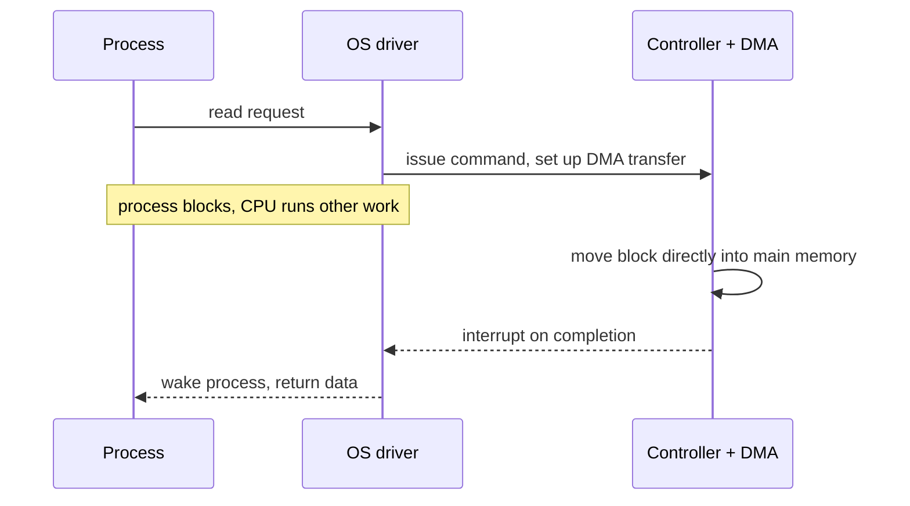

This note covers the hardware side of I/O (controllers, buses, DMA), what the OS's I/O system has to provide, and the characteristics of secondary storage. It is marked needs-review because the storage prices below came from lecture without a source.

## I/O hardware

I/O devices are typically **block devices**, which transfer data in fixed-size blocks, or **character devices**, which transfer data one character at a time as a stream.

A **device controller** is the hardware that connects the CPU to a device, and it is a small computer in its own right. It sends commands to the device and moves data in both directions. The CPU talks to controllers through controller registers or memory-mapped I/O, or hands transfers off to direct memory access (DMA).

Old computers hung everything off a single bus (the **system bus**) connecting the CPU, memory, and I/O devices, a topology like old Ethernet networks with a single broadcast domain. Modern systems use multiple buses. The **PCI** bus is a high speed backbone, and the other buses (**memory**, **SCSI**, **USB**, and so on) branch off of it.

The I/O system has to cope with a wide variety of devices that differ in transfer rate, data format, and control mechanism.

## What the OS I/O system provides

- A uniform interface across many devices, plus device-specific interfaces where necessary.
- Device communication and interaction through device drivers.
- A unique ID per device so applications can refer to it.

### Ways to drive a device

- **Programmed I/O with polling**: the CPU issues an I/O command for the process, and the process busy-waits until the I/O completes. Inefficient, since the CPU is tied up the whole time.
- **Interrupt-driven I/O**: the CPU issues the command and keeps executing. When the I/O completes, the device interrupts the CPU, which then handles the completion. The process may or may not block while waiting, but the processor stays free.
- **Direct Memory Access (DMA)**: the DMA module moves a block of data between the I/O module and main memory using physical addresses. The processor requests the transfer and gets interrupted when it finishes, so it never has to touch the data in between.

> [!tip] What each step buys
> Each option down the list frees more CPU: polling burns it for the whole transfer, interrupts free it between transfers, and DMA frees it during them.

## Secondary storage

Everything outside primary memory (RAM) counts as **secondary storage**: hard drives, SSDs, and other storage devices. Secondary storage doesn't allow direct execution of instructions or data access via load/store instructions; access goes through I/O operations.

Secondary storage is non-volatile, so data survives power loss. It is very slow compared to primary storage, it is failure-prone, and it is enormous for the price. Rough 2024 street prices from lecture:

- 2 TB HDD for $73, about $0.04/GB
- 30 TB HDD for $700
- 500 GB SSD for $50, about $0.10/GB
- 100 TB SSD for $40,000

### Memory hierarchy

| Level | Speed | Cost | Size | Volatility |
|-------|-------|------|------|------------|
| Registers | Fastest | Most Expensive | Smallest | Volatile |
| L1 Cache | Fast | Expensive | Small | Volatile |
| L2 Cache | Fast | Less Expensive | Still not a lot | Volatile |
| Main Memory | Slower | Less Expensive | Larger | Volatile |
| Secondary Storage | Slow | Cheap | Largest | Non-Volatile |
| Tertiary Storage | Slowest | Least Expensive | Largest | Non-Volatile |

### HDDs and SSDs

**HDDs** are mechanical devices that store data on spinning disks, with a read/write head that seeks across the disk. They are slow, but capacity is large and cheap. **SSDs** store data in flash memory. They are much faster than HDDs and cost more per byte. They are also more reliable and draw less power.

### Disks and the OS

Disks are messy, slow, error-prone devices, and it's the OS's job to make them look clean, fast, and easy to use.

The OS typically exposes disk access at different levels to different clients:

- **Physical block access**: read and write blocks at physical locations on the disk.
- **Logical block access**: read and write by disk block number, without knowing the physical location of the block.
- **File system**: read and write files at a specified offset, block, or byte.

Old disks only offered physical block access. Modern disk controllers map the physical geometry (cylinders, sectors, and so on) to logical block numbers $0$ through $n-1$, so the OS sees one contiguous range of blocks.

### Performance

An HDD's performance is dominated by its mechanically moving parts. Limiting seeks helps, and **defragmenting** helps, but only to an extent.

## Related notes

- [[systems/operating-systems/lecture-notes/file-systems|file systems]]
