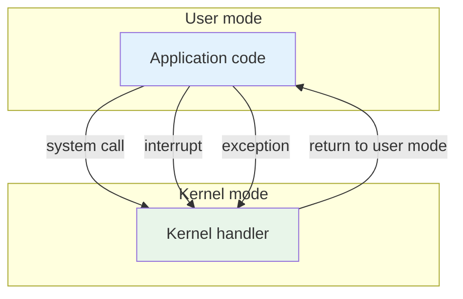

The question behind this note is who gets to control the hardware. The application could drive it directly, which would be simple and quick. It would also be completely unsafe. So the OS acts on the application's behalf, which gives us protection.

## Dual-mode operation

That raises the follow-up question of how to execute application code with restricted privileges. The hardware answers with two modes.

- **Kernel mode** is privileged. Code executes with full access to the hardware.
- **User mode** is restricted. Code can only execute the instructions the OS grants it (the non-privileged ones), and memory access is limited to the process's own memory.

A timer interrupt fires regularly, which guarantees the kernel gets a chance to take control back from a user process.

Per lecture, x86 stores the current mode in the EFLAGS register, and MIPS stores it in the status register.

> [!tip] Mode switch vs. context switch
> A syscall, interrupt, or exception switches the CPU's *mode*, but the same process stays on the CPU the whole time. A *context switch* swaps which process the CPU runs, and is a separate, more expensive operation (see [[systems/operating-systems/lecture-notes/handle-tables|handle tables]]). Mode switches happen far more often than context switches.

## Related notes

- [[systems/operating-systems/lecture-notes/processes|processes]]
- [[systems/operating-systems/v1-kernels-and-processes/2-the-kernel-abstraction|the kernel abstraction]]
