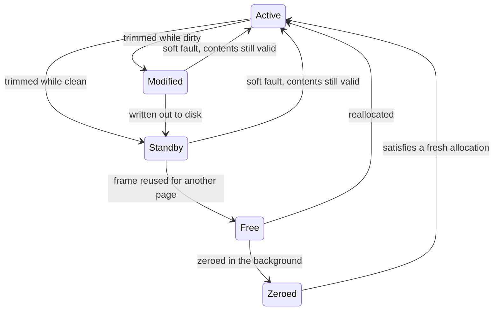

This note covers how Windows tracks the state of physical pages and how it picks replacement victims. It is marked needs-review because the exam question at the end was recorded from lecture without its solution.

## Page states in the PFN database

Every physical page has a state in the **page frame number (PFN) database**:

- **Active**: the page is in use and its contents are valid.
- **Transition**: the page is being moved between disk and memory.
- **Free**: the page is not in use. It sits on the free list.
- **Zeroed**: the page is filled with zeros. Windows maintains a list of zeroed pages to support demand paging, since a fresh allocation can be satisfied with one immediately.
- **Standby**: the page is not in use, but its contents are still valid, so it can be handed back to its process cheaply or reused for something else.
- **Modified**: the page's contents are valid but dirty; it has been modified since it was last read from disk, so the frame can't be reused until the page is written out.
- **Modified no-write**: like modified, except the memory manager is barred from writing it to disk. File systems use this to order writes; NTFS holds a page back until the log records covering the change have reached disk.
- **Rom**: the page is read-only memory.
- **Bad**: the page is defective and never used.

## Replacement

Windows mixes local and global page replacement. Each process has a working set, and pages get trimmed from it in roughly LRU order. Trimmed pages don't leave memory right away. Clean ones go to the standby list and dirty ones to the modified list, both of which behave FIFO, and a process that touches one of its trimmed pages gets it back with a cheap soft fault. The working sets give local, LRU-flavored replacement, and the standby list gives trimmed pages a global second chance.



## The idle process problem in early Windows

Under a pure **working set** replacement model, a process that goes idle for a long period loses all of its pages from memory. Background processes like antivirus and indexing services make it worse by demanding memory while the user is away. When the user comes back to the process, it has to wait for every page to be read back in from disk.

## An exam question from 2013

Examine how long a user mode program takes to write to an array of integers using various access patterns. Assume the entire array fits into memory, and that the system is idle apart from this program. The **stride** is the number of elements between consecutive accesses, and the array is a constant size of `PGSIZE` (4096 bytes).

```cpp
int access(int* arr, int size, int stride);
```

The lecture presented the question without a worked answer, so only the setup is recorded here.

## Related notes

- [[systems/operating-systems/lecture-notes/paging|paging]]
- [[systems/operating-systems/lecture-notes/tlb|translation lookaside buffers]]
- [[systems/operating-systems/lecture-notes/windows-rtz|Windows RtlZeroMemory]]
- [[systems/research/locality-principle|The Locality Principle]]
