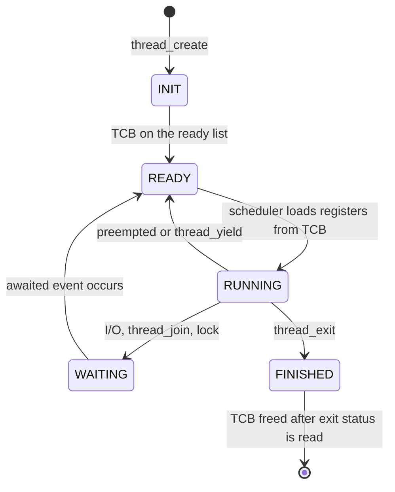
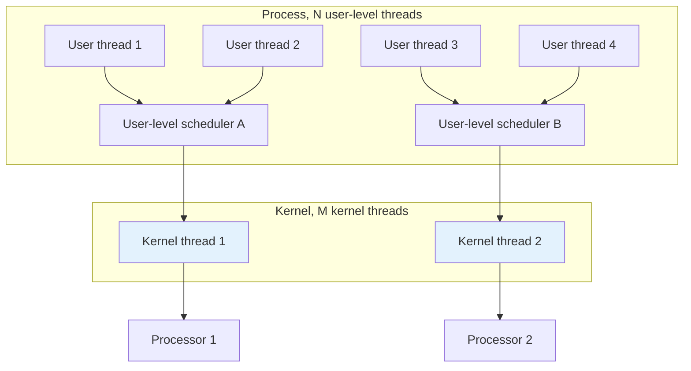

## Purpose

Notes on chapter 4 of [Operating Systems: Principles and Practice](https://ospp.cs.washington.edu/). The core question is what a thread actually is, how the OS implements one, and when you would reach for threads versus events or data parallelism.

## Thread Use Cases

- **Program structure: expressing logically concurrent tasks.** Many applications are naturally concurrent, and threads let you model that concurrency directly in code.
- **Responsiveness: shifting work to run in the background.** Move slow or blocking operations to a background thread so the main event loop stays responsive.
- **Performance: exploiting multiple processors.** Do more work in the same amount of time.
- **Performance: managing I/O devices.** If one thread blocks waiting for I/O, another thread can run on the CPU instead.

Processors are much faster than I/O devices. Disk I/O latency is measured in milliseconds, enough time for a CPU to execute millions of instructions. I/O like user input or network requests also has unpredictable latency, which is what makes overlapping I/O with computation worth the trouble.

A common pattern in I/O bound applications is to have multiple threads fetching different resources simultaneously. A media player might have one thread fetching the highest quality video, another fetching the highest quality audio, and a third fetching a low quality video stream for previews.

### Threads vs. Processes

Some scenarios for how threads and processes combine:

- **One thread per process.** One sequence of instructions, executing from beginning to end. The kernel runs those instructions in user mode, and the process uses system calls to request privileged operations.
- **Many threads per process.** Several concurrent threads, each executing within the restricted rights of the process. A subset of the process's threads run while the rest are suspended. Any thread in the process can make a system call, blocking itself without blocking its siblings. When an I/O interrupt arrives, the processor preempts one running thread so the kernel can run the handler, then resumes it afterward.
- **Many single-threaded processes.** Each process looks like a thread: a separate sequence of instructions, executing sometimes in the kernel and sometimes at user level. Concurrent processes can have concurrent system calls, even parallel ones on a multiprocessor.
- **Many kernel threads.** The kernel itself uses the thread abstraction for its own work, running separate threads in kernel mode.

## Thread Abstraction

A thread is two things:

- **A single execution sequence.** Each thread has its own stream of instructions it is executing.
- **Separately schedulable.** The kernel can run, suspend, and resume each thread independently of the others.

### Running, Suspending, and Resuming Threads

Threads provide the illusion of infinite processors. The OS uses a _thread scheduler_ to pick which threads run, and how threads are interleaved should be transparent to the application.

#### Cooperative vs. preemptive multithreading

Early versions of MacOS used cooperative multithreading, where the kernel switched threads only when the running thread made a system call relinquishing control. A thread that never yields hogs the CPU and starves everyone else. Modern operating systems use preemptive multithreading, where the kernel can preempt a thread at any point.

### Why "Unpredictable Speed"?

Never reason about the relative speed of threads when arguing your code is correct. Scheduling, cache state, interrupts, and load all make thread speed unpredictable, so a correct program has to work under every possible interleaving.

## POSIX Thread API

| Function Signature                                                                                          | Description                   |
| ----------------------------------------------------------------------------------------------------------- | ----------------------------- |
| `pthread_create(pthread_t *thread, const pthread_attr_t *attr, void *(*start_routine) (void *), void *arg)` | Create a new thread.          |
| `pthread_join(pthread_t thread, void **retval)`                                                             | Wait for a thread to finish.  |
| `pthread_detach(pthread_t thread)`                                                                          | Detach a thread.              |
| `pthread_self()`                                                                                            | Get the current thread.       |
| `pthread_exit(void *retval)`                                                                                | Terminate the current thread. |
| `pthread_cancel(pthread_t thread)`                                                                          | Cancel a thread.              |

Threads enable **asynchronous procedure calls**, where the called function runs in the background. The textbook uses a simplified `thread.h` API for its examples (the real `pthread_create` takes the four arguments in the table above):

```c
 #include <stdio.h>
 #include "thread.h"
 static void go(int n);
 #define NTHREADS 10
 static thread_t threads[NTHREADS];

 int main(int argc, char **argv) {
    int i;
    long exitValue;
    for (i = 0; i < NTHREADS; i++){
       thread_create(&(threads[i]), &go, i);
    }

    for (i = 0; i < NTHREADS; i++){
        exitValue = thread_join(threads[i]);
        printf("Thread %d returned with %ld\n",
        i, exitValue);
    }

    printf("Main thread done.\n");
    return 0;
 }

 void go(int n) {
    printf("Hello from thread %d\n", n);
    thread_exit(100 + n);
    // Not reached
 }
```

### Fork-Join Parallelism

Example: zero a block of memory using multiple threads. Operating systems zero memory constantly, for instance after a process exits so its data does not leak to the next process. The textbook's numbers make the case for parallelizing: zeroing 1 GB of memory takes about 50 ms on modern hardware, while creating a thread costs on the order of 10 microseconds.

```c
 // To pass two arguments, we need a struct to hold them.
 typedef struct params {
    unsigned char *buffer;
    int length;
 };

 #define NTHREADS 10
 void go (struct params *p) {
    memset(p->buffer, 0, p->length);
 }
 // Zero a block of memory using multiple threads.
 void blockzero (unsigned char *p, int length) {
    int i;
    thread_t threads[NTHREADS];
    struct params params[NTHREADS];

    // For simplicity, assumes length is divisible by NTHREADS.
    assert((length % NTHREADS) == 0);

    for (i = 0; i < NTHREADS; i++) {
        params[i].buffer = p + i * length/NTHREADS;
        params[i].length = length/NTHREADS;
        thread_create_p(&(threads[i]), &go, &params[i]);
    }

    for (i = 0; i < NTHREADS; i++)
        thread_join(threads[i]);
 }
```

You can also zero memory lazily with a background thread that runs while another process executes. When the memory is needed again, join on the background thread.

## Thread Data Structures and Life Cycle

The important split is between shared and per-thread state. Shared state consists of code, global variables, and heap-allocated memory. Per-thread state consists of the thread's stack, registers, and metadata, tracked in a **thread control block (TCB)** per thread.

### Thread Control Block

For every thread it creates, the OS allocates a TCB holding both the state of the computation and the metadata needed to manage the thread.

#### Per-thread Computation State

Each thread needs a pointer to the top of its own stack, which works the same as a single-threaded program's stack: one frame per function call, holding local variables, parameters, and the return address. **When a new thread is created, the OS allocates it a new stack.**

The TCB also needs the processor registers. Some systems store them at the top of the thread's stack, others put dedicated space in the TCB.

#### How big of a stack?

Kernel stacks live in physical memory, so it pays to keep them small. Kernel code keeps procedure call nesting shallow and allocates all large data structures on the heap by convention, which is what makes small kernel stacks workable. Allocating a large structure as a local variable in kernel code is how you blow one up.

User-level stacks live in virtual memory, so they are less constrained. Multithreaded programs still cannot grow stacks indefinitely (Go is an exception, growing stacks automatically), and stack overflow is easy to hit in multithreaded programs. POSIX lets you configure stack size. Most implementations try to detect overflow by placing known values at the ends of the stack and checking them, which catches many overflows without being foolproof.

#### Per-thread Metadata

Thread id, scheduling priority, status, and similar bookkeeping.

Per-thread metadata also includes thread-local variables, which span function calls like globals do while staying private to each thread. `errno` is the classic example: a macro that expands to a thread-local variable holding the error code of the last system call. Heap allocators also lean on thread-local state, subdividing the heap into per-thread regions so parallel allocation avoids contention.

### Shared State

Program code, statically allocated global variables, and dynamically allocated heap variables. The kernel does not enforce protection between threads for per-thread state, so you have to know which variables are meant to be shared (globals, heap objects) and which are meant to be private (locals).

## Thread Life Cycle

| State    | Location of TCB                         | Location of registers |
| -------- | --------------------------------------- | --------------------- |
| INIT     | Being created (stack)                   | TCB                   |
| READY    | Ready list                              | TCB                   |
| RUNNING  | Running list                            | CPU                   |
| WAITING  | Synchronization variable's waiting list | TCB                   |
| FINISHED | Finished list then deleted              | TCB or deleted        |



### INIT

- Put the thread into INIT state and allocate and initialize its per-thread data structures.
- Move it to READY and add it to the _ready list_, usually some form of queue, sometimes a priority queue.

### READY

- The thread could run, and its TCB sits on the ready list holding its register values.
- At any point the scheduler can load those registers onto a processor and move the thread to RUNNING.

### RUNNING

- The thread is executing on a processor, so its registers live in the CPU rather than the TCB.
- The scheduler can preempt it back to READY (saving registers to the TCB and loading another thread's), or the thread can yield voluntarily with `thread_yield`.
- Some OSes (Linux among them) keep RUNNING threads on the front of the ready list.

### WAITING

- The thread is waiting for some event: I/O completion, a `thread_join`, a lock.
- Its TCB sits on the wait list of the synchronization variable it is waiting on. When the event occurs, it moves back to READY.

### FINISHED

- The thread has finished and will never run again.
- Most resources are freed, but the TCB stays on the _finished list_ so a parent can still retrieve the exit status through `thread_join`. After that, the TCB can be fully freed.

#### The idle thread

A system with k processors keeps exactly k threads in the RUNNING state. When a processor has nothing to run, it runs the idle thread, which on modern systems is a loop that executes `hlt` to drop the CPU into a low power state until the next interrupt. The low power mode is also useful for virtualization, since the host OS can hand the idle VM's resources to a different VM.

#### Where is the TCB stored?

On a multiprocessor this takes some thought. x86 has hardware support for fetching the ID of the current processor, so the TCB pointer can live in a global array indexed by processor. Without hardware support, you can exploit the fact that the stack pointer is unique per thread: store a pointer to the TCB at the base of the thread's stack, below the procedure frames, and mask the stack pointer to find it.

## Implementing Kernel Threads

```c
 // func is a pointer to a procedure the thread will run.
 // arg is the argument to be passed to that procedure.
 void thread_create(thread_t *thread, void (*func)(int), int arg) {
   // Allocate TCB and stack
   TCB *tcb = new TCB();
   thread->tcb = tcb;
   tcb->stack_size = INITIAL_STACK_SIZE;
   tcb->stack = new Stack(INITIAL_STACK_SIZE);
   // Initialize registers so that when thread is resumed, it will start running at
   // stub. The stack starts at the top of the allocated region and grows down.
   tcb->sp = tcb->stack + INITIAL_STACK_SIZE;
   tcb->pc = stub;
   // Create a stack frame by pushing stub's arguments and start address
   // onto the stack: func, arg
   *(tcb->sp) = arg;
   tcb->sp--;
   *(tcb->sp) = func;
   tcb->sp--;
   // Create another stack frame so that thread_switch works correctly.
   // This routine is explained later in the chapter.
   thread_dummySwitchFrame(tcb);
   tcb->state = READY;
   readyList.add(tcb); // Put tcb on ready list
 }

 void stub(void (*func)(int), int arg) {
   (*func)(arg); // Execute the function func()
   thread_exit(0); // If func() does not call exit, call it here.
 }
```

Creating a thread runs `func` asynchronously with the calling thread. The steps:

1. **Allocate per-thread state.** Space for the new thread's TCB and stack.
2. **Initialize per-thread state.** Set up the TCB registers for the RUNNING state, and arrange for `func` to return into a stub that calls `thread_exit`.
3. **Put the TCB on the ready list.** Set state to READY and enqueue it, making it schedulable.

### Deleting a thread

When a thread calls `thread_exit`, it must come off the ready lists so it stops being scheduled, and its per-thread state must be freed.

A thread cannot free its own resources. If it were interrupted mid-cleanup, it would never be scheduled again to finish, leaking memory. So the exiting thread sets its state to FINISHED and puts itself on the finished list for some _other_ thread to clean up.

### Thread Context Switch

To move a thread from RUNNING to READY, the OS saves its register values into its TCB, then loads the next thread's register values from that thread's TCB.

Interrupts must be disabled during the switch (OSPP p. 47 works through this). The problem case: a low priority thread checks the ready list, finds a high priority thread, and voluntarily yields to it. If an interrupt lands between the check and the switch and the handler moves things around, the high priority thread can end up parked on the ready list while a lower priority one keeps the processor.

```c
// We enter as oldThread, but we return as newThread.
 // Returns with newThread's registers and stack.
 void thread_switch(oldThreadTCB, newThreadTCB) {
   pushad; // Push general register values onto the old stack.
   oldThreadTCB->sp = %esp; // Save the old thread's stack pointer.
   %esp = newThreadTCB->sp; // Switch to the new stack.
   popad; // Pop register values from the new stack.
   return;
 }
 void thread_yield() {
   TCB *chosenTCB, *finishedTCB;
   // Prevent an interrupt from stopping us in the middle of a switch.
   disableInterrupts();
   // Choose another TCB from the ready list.
   chosenTCB = readyList.getNextThread();
   if (chosenTCB == NULL) {
      // Nothing else to run, so go back to running the original thread.
   } else {
      // Move running thread onto the ready list.
      runningThread->state = ready;
      readyList.add(runningThread);
      thread_switch(runningThread, chosenTCB); // Switch to the new thread.
      runningThread->state = running;
   }
   // Delete any threads on the finished list.
   while ((finishedTCB = finishedList->getNextThread()) != NULL) {
      delete finishedTCB->stack;
      delete finishedTCB;
   }
   enableInterrupts();
 }
 // thread_create must put a dummy frame at the top of its stack:
 // the return PC and space for pushad to have stored a copy of the registers.
 // This way, when someone switches to a newly created thread,
 // the last two lines of thread_switch work correctly.
 void thread_dummySwitchFrame(newThread) {
   *(tcb->sp) = stub; // Return to the beginning of stub.
   tcb->sp--;
   tcb->sp -= SizeOfPopad;
 }
```

#### Separating mechanism from policy

Separate the mechanics of performing an action from the rules deciding when to perform it. `thread_switch` is a mechanism for switching threads; the policy for when to switch lives in the scheduler. Different systems can then take their own approach to scheduling without touching the switch code. Virtual memory splits the same way: the MMU is the mechanism for translating addresses, while the page replacement algorithm is the policy for what stays in memory.

Switches come in two flavors:

- **Voluntary switch**: the thread calls a library function that triggers the switch (`thread_yield`, and similarly `thread_exit` and `thread_join`).
- **Involuntary switch**: the OS preempts the thread via an interrupt or exception. The interrupt hardware saves the current thread's state, then the handler runs (a timer interrupt switching to another thread, or user I/O like keyboard input).

## Combining Kernel Threads and Single-Threaded User Processes

### Switching between kernel threads and kernel handlers

- **Entering the handler**: the hardware checks the eflags register to see whether it is already in kernel mode. If so, it pushes only the instruction pointer and eflags onto the current stack. If it was in user mode, it also pushes the stack pointer and switches to the interrupt stack.
- **Returning from the handler**: inspect the saved eflags to see whether the return goes back to user mode. If so, pop the stack pointer along with the instruction pointer and eflags; if it stays in the kernel, pop only the instruction pointer and eflags.

## Implementing Multi-threaded Processes

### Multithreaded Processes with Kernel Threads

A thread in a process has a user-level stack, a kernel interrupt stack, and a kernel TCB. To create a thread, the process calls a library function that allocates a user-level stack, then makes a system call to create the kernel thread and return a thread id. The kernel allocates the TCB and kernel stack and puts the thread on the ready list. `join`, `exit`, and `yield` are likewise system calls that manipulate TCBs and the ready list.

### User-Level Threads without Kernel Threads

Threading can be added to an OS with no kernel support at all. Early versions of the JVM did this with _green threads_. The process implements the kernel's data structures and scheduling policies in user space, so threading operations become plain procedure calls instead of system calls.

The limits: the user-level scheduler is invisible to the OS scheduler and cannot use multiple processors, and if the process blocks on I/O, every thread inside it blocks.

### Preemptive User-Level Threads

Preemption at user level rides on **signals**. To preempt within process **P**:

1. The user-level thread library makes a system call to register a timer signal handler and signal stack with the kernel.
2. When a hardware timer interrupt occurs, the hardware saves P's register state and runs the kernel's handler.
3. Instead of restoring P's register state and resuming P where it was interrupted, the kernel's handler copies P's saved registers onto P's signal stack.
4. The kernel resumes execution in P at the registered signal handler on the signal stack.
5. The signal handler copies the processor state of the preempted user-level thread from the signal stack to that thread's TCB.
6. The signal handler chooses the next thread to run, re-enables the signal handler (the equivalent of re-enabling interrupts), and restores the new thread's state from its TCB into the processor.

### User-Level Threads with Kernel Support

A process uses $M$ kernel threads, each with its own user-level scheduler multiplexing $N$ user-level threads. The kernel schedules the kernel threads, and the user-level scheduler schedules its threads on top of them. The problem remains that a kernel thread blocked on I/O takes its whole user-level scheduler down with it for the duration.



#### Scheduler Activations

Let the user and kernel level schedulers coordinate with each other. This costs system calls and upcalls in both directions, but it keeps the kernel unaware of individual user-level threads and optimizes the common case.

- The user-level scheduler makes system calls to request or free processors.
- The kernel upcalls the user-level scheduler to notify it of events:
  - A processor becomes available or unavailable.
  - A thread transitions to `WAITING` (e.g. for I/O).
  - A thread transitions from `WAITING` to `READY`.
  - A processor transitions from `RUNNING` to idle.

A **scheduler activation** replaces the kernel thread as the execution context. It has its own stack and CPU context and is schedulable like a kernel thread, but when the kernel interrupts it, execution restarts in the user-level scheduler, which decides which user-level thread runs next.

## Alternatives to Threads

### Asynchronous I/O and Event-Driven Programming

Instead of dedicating threads to I/O, use asynchronous I/O. The process issues an I/O request via system call, the call returns immediately, and the process keeps running. When the I/O completes, the kernel notifies the process by one of:

- calling a signal handler (callback)
- placing the result in a queue in the process's address space
- placing the result in a queue in the kernel's address space, which the process polls through a system call

A common design is a single thread interleaving many I/O bound tasks by waiting on multiple events at once. A web server with 10 active clients issues one `select` call over all 10 connections, and when it returns, reads from whichever client has data ready, without blocking.

#### Event-Driven Programming

The pattern extends to requests that involve a sequence of I/O operations. Handling a web request means accepting a connection, then reading the request, then processing it, then reading the requested data from disk or a database, then writing the response. **Event-driven programming** tracks each in-flight task with a **continuation**, a data structure recording the task's current state and next step.

#### Event-Driven Programming vs. Threads

The two are close relatives. In either case the program blocks until a task can proceed, restores that task's state, executes its next step, and blocks again. The difference is where the state lives: in a continuation managed by the program, or in a thread managed by the OS.

For example, a web server that reads from multiple clients and stores the data in a table of buffers:

```c

 Hashtable<Buffer*> *hash;

 while(1) {
   connection = use select() to find a
                  readable connection ID
   buffer = hash.remove(connection);
   got = read(connection, tmpBuf, TMP_SIZE);
   buffer->append(tmpBuf, got);
   buffer = hash.put(connection, buffer);
 }

 // Thread-per-client
 Buffer *b;
 while(1) {
   got = read(connection, tmpBuf, TMP_SIZE);
   buffer->append(tmpBuf, got);
 }
```

##### Performance

The usual argument for event-driven programming is speed, for two reasons:

1. **No context switch overhead.** Context switches cost time, arrive unpredictably, and trash caches and the TLB.
2. **No memory overhead.** Thread stacks take space. On modern systems this matters less than it used to: 1000 threads with 8 KB stacks on a 1 GB machine is under 1% of memory.

On the other side, a purely event-driven program cannot use multiple processors, so in practice events get combined with threads: a process runs $N$ threads, each multiplexing tasks with an event-driven model. Event-driven code is also harder to reason about, and when there is real background work to do, threads are often simpler.

### Data Parallel Programming

SIMD instructions perform the same operation on multiple pieces of data at once. The x86 `addps` instruction adds 4 single precision floats in one go, which is exactly the shape of work in image processing, where the same operation applies to every pixel. In data parallel programming you specify the operation on one piece of data and the hardware applies it across many.

This shows up all over. SQL databases identify which parts of a query can run in parallel. Multimedia streaming uses SIMD to encode and decode video. GPUs are the specialized-hardware version of the same idea. At datacenter scale, MapReduce splits a large dataset into pieces, applies a function to each piece in parallel, and combines the results.

## Related notes

- [[systems/operating-systems/v2-concurrency/5-synchronizing-access-to-shared-objects|synchronization]]
- [[systems/operating-systems/v2-concurrency/7-uniprocessor-scheduling|uniprocessor scheduling]]
- [[systems/operating-systems/v2-concurrency/7-multiprocessor-scheduling|multiprocessor scheduling]]
