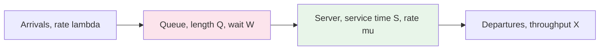

## Purpose

Notes on the queueing theory section of chapter 7 of [Operating Systems: Principles and Practice](https://ospp.cs.washington.edu/). Queueing theory gives back-of-the-envelope answers to questions like "what happens to response time if utilization doubles" without simulating anything. The same math applies to CPUs, disks, networks, and anything else that serves requests from a queue.

Simplifying assumptions used throughout:

- **Work preserving**: the system will eventually process all requests.
- **FIFO scheduling**: requests are processed in the order they arrive.

## Definitions

- **Server**: anything that performs tasks, e.g. CPU, disk, network link.
- **Queueing delay ($W$)**: total time a task spends waiting to be scheduled. In a time-slicing system the task may wait many separate times, and $W$ is the sum of those waits.
- **Tasks queued ($Q$)**: number of tasks in the queue.
- **Service time ($S$)**: time to complete a task, assuming no waiting.
- **Response time ($R$)**: time for a task to complete, including queueing and service time.
    - $R = W + S$. Improving overall response time means reducing either the queueing time or the service time.
- **Arrival rate ($\lambda$)**: number of tasks arriving per unit time.
- **Arrival process**: the distribution of the time between task arrivals.
- **Service rate ($\mu$)**: number of tasks completed per unit time when busy. $\mu = 1/S$.
- **Utilization ($U$)**: fraction of time the server is busy.
    - $0 \leq U \leq 1$.
    - $U = \lambda / \mu$ if $\lambda < \mu$.
    - $U = 1$ if $\lambda \geq \mu$.
- **Throughput ($X$)**: number of tasks completed per unit time.
    - $X = U \cdot \mu$.
    - $X = \lambda$ if $U < 1$.
    - $X = \mu$ if $U = 1$.
- **Tasks in the system ($N$)**: tasks in the system, both in service and queued.
    - $N = Q + U$ on average, since utilization equals the average number of tasks in service at a single server.

All of the symbols in one picture:



## Little's Law

For any stable system, regardless of arrival distribution or scheduling policy:

$$N = X \cdot R$$

The average number of tasks in the system equals throughput times average response time. If throughput is 10 tasks per second and average response time is 5 seconds, there are on average 50 tasks in the system.

The law applies to any bounded subsystem, and that flexibility is what makes it useful. Applied to just the server (excluding the queue), the "tasks inside" is the average number in service, which is $U$, and the "time inside" is $S$, giving $U = X \cdot S$.

### Examples

A server processes requests sequentially. Requests arrive (and depart) at an average of 100 requests/sec, and the average request takes 5 ms of service. Applying Little's Law to the server alone:

$$U = X \cdot S = 100 \cdot 0.005 = 0.5$$

The server is busy 50% of the time.

A web service takes an average of 100 ms to complete a request and handles 10,000 queries per second. Applying Little's Law to the whole system:

$$N = X \cdot R = 10000 \cdot 0.1 = 1000 \text{ queries in the system}$$

## Response Time vs. Utilization

Operating a system at high utilization raises the risk of overload. If $\lambda > \mu$, the queue grows without bound and response time grows with it. Higher arrival rate $\lambda$ and burstier arrival processes both push queue lengths up.

### Best Case: Uniform Arrival

With perfectly evenly spaced arrivals:

- $\lambda < \mu$: $R = S$. Queues shrink until empty and stay empty.
- $\lambda = \mu$: $R = S$. Queues hold steady.
- $\lambda > \mu$: $R \to \infty$. Queues grow indefinitely. In practice requests get dropped or the system fails.

### Worst Case: Bursty Arrival

Requests often arrive in groups. The queue grows during a burst and drains between bursts, and average response time suffers even when the average arrival rate is well under the service rate. Compare:

- System 1: $\lambda = 1$ request/second, $S = 1$ second, uniform arrivals.
- System 2: $\lambda = 1$ request/second, $S = 1$ second, bursty arrivals of 10 requests every 10 seconds.

System 1 serves each request as it arrives. The queue stays empty and every request sees $R = 1$ second:

$$
R = \frac{1}{10} \sum_{i=1}^{10} 1 = 1 \text{ second}
$$

System 2 serves each burst sequentially. The $i$-th request in the burst waits for the $i - 1$ requests ahead of it, finishing at time $i$:

$$R = \frac{1}{10} \sum_{i=1}^{10} i = 5.5 \text{ seconds}$$

Same average arrival rate, 5.5x the average response time. In general, for bursts of $n$ requests with service time $S$ each, the $i$-th request in a burst finishes at $i \cdot S$, so

$$
R = \frac{1}{n} \sum_{i=1}^{n} i \cdot S = \frac{(n+1) S}{2}
$$

### Exponential Arrivals

An **exponential distribution** with rate $\lambda$ has mean $\lambda^{-1}$, variance $\lambda^{-2}$, and probability density

$$
f(x) = \lambda e^{-\lambda x}
$$

It is *memoryless*: given that you have already waited $s$ seconds, the probability of waiting at least $t$ more is the same as it was from the start, $P(X > s + t \mid X > s) = P(X > t)$.

Memorylessness is what makes the math tractable. With exponential interarrival and service times, the queue becomes a state machine whose states are the number of tasks in the system, with transition rate $\lambda$ up (an arrival) and $\mu$ down (a departure), and no other history matters.

Assuming $\lambda < \mu$, the system is stable, and solving that state machine gives response time as a function of utilization and service time:

$$
R = \frac{S}{1 - U}
$$

The shape of this curve is the practical takeaway. At low utilization, response time barely rises above $S$. As $U$ approaches 1, the denominator goes to zero and response time blows up. At $U = 0.5$ you pay 2x the service time, at $U = 0.9$ you pay 10x. This is why operators leave headroom instead of running servers near full utilization.

> [!warning] The hockey stick has no safe side of the bend
> Plotted against $U$, the curve $R = S/(1-U)$ is nearly flat below $U \approx 0.5$, bends visibly around $0.7$, and goes vertical approaching $1$: each halving of the remaining headroom doubles response time (2x at 0.5, 10x at 0.9, 100x at 0.99). A system provisioned at 95% utilization is not "5% away from trouble" — it is already at 20x its unloaded latency, and any burst pushes it toward the asymptote.

## M/M/1 Reference Results

The exponential-arrivals, exponential-service, single-server queue in Kendall notation is M/M/1 ("M" for memoryless). Writing $\rho = U = \lambda/\mu$, the state machine solves to a geometric distribution over queue states, $P(N = n) = (1-\rho)\rho^n$, and everything follows:

$$
N = \frac{\rho}{1-\rho}, \qquad
R = \frac{S}{1-\rho}, \qquad
Q = \frac{\rho^2}{1-\rho}, \qquad
W = \frac{\rho S}{1-\rho},
$$

with $N = XR$ and $Q = XW$ as Little's Law cross-checks. Response time is exponentially distributed with mean $R$, so percentiles are multiples of the mean: the $q$-th percentile is $-\ln(1-q) \cdot R$, giving p50 = $0.69R$, p90 = $2.3R$, p99 = $4.6R$, p99.9 = $6.9R$. Both the mean and every percentile inherit the $1/(1-\rho)$ pole.

Concrete example: $S = 10$ ms, $\lambda = 90$/s, so $\rho = 0.9$. Then $R = 100$ ms, $N = 9$ tasks in system, and p99 response time is $4.6 \times 100 = 460$ ms — a p99 46x the service time, from utilization alone, before any real-world variability is added.

## Service-Time Variability: M/D/1 and M/G/1

Memoryless service is a modeling convenience. The M/G/1 queue keeps Poisson arrivals but allows *any* service distribution, and has an exact mean-wait formula, Pollaczek-Khinchine ([Larson and Odoni §4.7](https://web.mit.edu/urban_or_book/www/book/chapter4/4.7.html)):

$$
W = \frac{\lambda \, \mathbb{E}[S^2]}{2(1-\rho)}
= \frac{\rho}{1-\rho} \cdot \frac{1 + C_s^2}{2} \cdot S,
$$

where $C_s^2 = \operatorname{Var}[S]/\mathbb{E}[S]^2$. The utilization pole is unchanged; service variability enters as a clean multiplier $(1+C_s^2)/2$ on the waiting time:

- **M/D/1** (deterministic service, $C_s^2 = 0$): half the M/M/1 wait. At $\rho = 0.9$, $S = 1$: $R = 1 + 0.9/(2 \cdot 0.1) = 5.5$ versus M/M/1's 10. Fixed-size work units buy a 2x latency improvement at identical load.
- **M/M/1** ($C_s^2 = 1$): the baseline.
- **Heavy-tailed service** ($C_s^2 \gg 1$): waits scale linearly in $C_s^2$. A bimodal workload where 5% of requests take 10 s and the rest take 0.53 s (mean 1 s, $C_s^2 = 4.26$) at $\rho = 0.9$ has $R = 24.7$ — 2.5x M/M/1 and 4.5x M/D/1 with the *same mean service time and same utilization*.

The operational reading: variance is a first-class capacity cost. Splitting occasional huge requests into uniform chunks, capping request sizes, or isolating slow request classes in their own queue all reduce $\mathbb{E}[S^2]$ and buy latency without new hardware.

## Checking the Formulas by Simulation

A single-server FIFO queue is four lines of recurrence: a request starts when it arrives or when its predecessor departs, whichever is later. This script (run in the repo venv, 2M requests per case) checks every closed form above:

```python
import numpy as np
rng = np.random.default_rng(0)

def sim(rho, sv_fn, n=2_000_000):
    arr = np.cumsum(rng.exponential(1/rho, n))   # Poisson arrivals, mu = 1
    sv = sv_fn(n)
    dep, prev = np.empty(n), 0.0
    for i in range(n):
        start = arr[i] if arr[i] > prev else prev
        dep[i] = start + sv[i]
        prev = dep[i]
    R = dep - arr
    return R.mean(), np.percentile(R, 99)

fast = (1 - 0.05 * 10) / 0.95                    # bimodal: mean 1, cv^2 = 4.26
bimodal = lambda n: np.where(rng.random(n) < 0.05, 10.0, fast)

print(sim(0.9, lambda n: rng.exponential(1.0, n)))  # M/M/1
print(sim(0.9, lambda n: np.full(n, 1.0)))          # M/D/1
print(sim(0.9, bimodal))                            # M/G/1
```

Measured against predicted, all at $\rho = 0.9$, $\mathbb{E}[S] = 1$:

| Model | predicted $R$ | simulated $R$ | simulated p99 |
| --- | --- | --- | --- |
| M/M/1 | 10.00 | 10.18 | 45.2 (predicted 46.1) |
| M/D/1 | 5.50 | 5.55 | 23.2 |
| M/G/1 bimodal | 24.68 | 24.71 | 120 |

The Pollaczek-Khinchine prediction for the bimodal case lands within 0.2%, and the p99 column makes the tail cost visible: the heavy-tailed workload's p99 is 5x the M/D/1 queue's at identical mean load.

## Burstiness Revisited

The burst example earlier showed 5.5x mean response time at identical average $\lambda$. The M/G/1 lens generalizes it: variability on the *arrival* side plays the same role as variability on the service side. The standard approximation for a general-arrivals, general-service queue (G/G/1, Kingman's formula) is

$$
W \approx \frac{\rho}{1-\rho} \cdot \frac{C_a^2 + C_s^2}{2} \cdot S,
$$

with $C_a^2$ the squared coefficient of variation of interarrival times. Uniform arrivals have $C_a^2 = 0$, Poisson $C_a^2 = 1$, and bursty traffic — retry storms, thundering herds after a cache flush, synchronized cron jobs — pushes $C_a^2$ far above 1. Mean utilization does not appear in $C_a^2$ at all, which is the formula-level statement of why "the server is only 60% busy on average" and "requests time out every hour at :00" are consistent observations. Smoothing arrivals (jittered retries, staggered schedules, admission control) attacks $C_a^2$ exactly as chunking work attacks $C_s^2$.

What tail-focused engineering does with these facts — percentile SLOs, fan-out amplification, hedged requests — is in [[systems/performance/tail-latency-percentiles|Tail Latency, Percentiles, and Queueing Distributions]]; scheduling-policy consequences are in [[systems/scheduling/0-foundations/queueing-models-and-tail-latency|queueing models and tail latency]].

## Related notes

- [[systems/scheduling/0-foundations/littles-law-and-bottleneck-analysis|Little's Law and bottleneck analysis]]
- [[systems/scheduling/0-foundations/queueing-models-and-tail-latency|queueing models and tail latency]]
- [[systems/performance/latency-throughput-and-utilization|latency, throughput, and utilization]]
- [[systems/performance/tail-latency-percentiles|tail latency, percentiles, and queueing distributions]]
- [[systems/operating-systems/v2-concurrency/7-uniprocessor-scheduling|uniprocessor scheduling]]
- [[systems/operating-systems/v2-concurrency/7-multiprocessor-scheduling|multiprocessor scheduling]]
