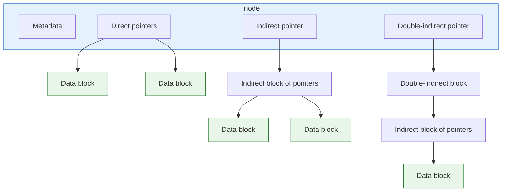

## Purpose

Notes on chapter 13 of [Operating Systems: Principles and Practice](https://ospp.cs.washington.edu/). The chapter answers how a file system maps a name plus an offset to actual blocks on a storage device, while staying fast, flexible, persistent, and reliable. The abstraction this implements is covered in [[systems/operating-systems/v4-persistent-storage/11-file-systems-overview|file-system overview]].

## Implementation Overview

Most implementations are built from four ideas:

1. **directories**, which map names to file numbers
2. **index structures**, which map file numbers and offsets to storage blocks
3. **free space maps**, which track which blocks are available
4. **locality heuristics**, which decide where to put data

### Directories and Index Structures

Resolving a file name and offset to a storage block happens in two steps. The directory maps the name to a file number, then the index structure maps that file number and offset to a block. The index is usually some form of tree.

### Free Space Maps

The free space map tracks which blocks are free and which are in use. At minimum it just has to work, but a good one also allocates blocks so files get better spatial locality. Many file systems implement the free space map as a bitmap in persistent storage.

### Locality Heuristics

The OS chooses where to place data to increase spatial locality. Storing files from the same directory in the same region of the disk is the common example, since those files tend to be accessed together. Some systems also periodically _defragment_ the disk, rewriting files to be contiguous.

## Directories: Naming Data

A directory can simply be a file holding name to file number mappings. The bootstrap is a predefined file number for the root directory; the Unix Fast File System (FFS) and many of its descendants use 2. Files in the same directory are often accessed together, so storing them in the same area of the disk lets caching do its work.

Directories are files, but they get their own API so users cannot accidentally corrupt the directory structure. Processes can still `read` a directory to list its contents, and syscalls like `getdents` on Linux make that convenient.

### Internals

Simple lists of name/number pairs work, and early Unix systems used exactly that. Modern file systems use trees to handle large directories: Linux XFS, Microsoft NTFS, and Oracle ZFS all do.

In XFS, a directory is stored inside a file as a B+ tree. The variable-size directory entries sit at the start of the file, the tree's root node lives at a known offset (`BTREE_ROOT_PTR`), and the fixed-size internal and leaf nodes follow the root. Each tree node points to where in the file its children sit, so a lookup walks from the root down to the entry.

### Links

Hard links are multiple names, and so multiple directory entries, for the same file. The OS reference counts the links and garbage collects the file when the last one is unlinked. Soft (symbolic) links are files whose content maps to the name of another file.

Hard links have a structural consequence: file metadata cannot live in the directory entry, because two entries would then hold two competing copies. Metadata has to live with the file itself, which is what the index structure provides a home for.

## Files: Finding Data

File systems usually aim to:

- Locate the disk blocks belonging to a file
- Maximize sequential data placement
- Provide efficient access to all blocks
- Minimize overhead for small files
- Scale to large files
- Provide a place for metadata

Storage hardware arranges data in *sectors* (magnetic disk) or *pages* (flash), but file systems allocate in *blocks*, a power-of-two multiple of the sector or page size. Linux uses 4KB blocks on 512 byte sectors. FAT and NTFS call blocks *clusters*. File systems also place data in variable length runs of contiguous blocks called *extents* (NTFS calls them *runs*).

## Case Study: FAT

FAT is a very simple file system that uses a linked list as its index structure. It survives in flash drives and SD cards, and the most recent version, FAT32, supports volumes with up to $2^{28}$ blocks and files up to $2^{32} - 1$ bytes.

The FAT itself is an array of 32-bit entries in a reserved area of the volume, one entry per block. A file is a linked list threaded through the FAT: each entry holds the index of the file's next block. A directory maps each file name to the index of the file's first FAT entry.

The FAT doubles as the free space map. The OS scans for unused entries (0x00000000) to find free blocks.

FAT uses simple allocation strategies like first-fit or next-fit, which fragment over time, so some implementations ship a defragmentation tool that rewrites files contiguously. The FAT defragmenter in Windows XP tries to rewrite each file into a single extent.

Its simplicity keeps it everywhere. Beyond simple storage devices, some applications use FAT-style layouts internally; Anderson and Dahlin note a FAT-like file system embedded in the .doc format used by Microsoft Word from 1997 to 2007.

Drawbacks:

- Usually poor locality of file data
- Poor random access, since reaching an offset means walking the linked list
- Limited metadata and no access control
- No hard links
- Limited volume and file sizes (the $2^{28}$ block and $2^{32} - 1$ byte limits above)
- No support for transactional updates

> [!example] Why random access hurts
> Reaching an offset means walking the chain from the file's first FAT entry. Reading the last block of a 1 GB file with 4 KB clusters walks 262,144 FAT entries before the first byte of data arrives.

## Other Index Structures

**Unix Fast File System (FFS)**: a tree-based multi-level index (the inode with direct, indirect, double-indirect pointers), plus many locality heuristics for good spatial locality. Linux's ext2 and ext3 are based on FFS.

Small files stay cheap because their blocks hang directly off the inode, while each level of indirection multiplies reach by the number of pointers per block, which is how the same fixed structure scales to large files.

**NTFS**: a tree-based structure more flexible than FFS's fixed indexing scheme, indexing variable-sized extents instead of individual blocks. Beyond Windows, NTFS's techniques appear in many modern file systems (ext4, XFS, HFS, HFS+).

**ZFS**: **copy-on-write**, writing new versions of files to free disk space instead of overwriting old versions. This optimizes for reliability and write performance.

## Related notes

- [[systems/operating-systems/v4-persistent-storage/11-file-systems-overview|file-system overview]]
- [[systems/databases/foundations/ch3-storage-and-retrieval|storage and retrieval techniques]]
- [[systems/operating-systems/lecture-notes/file-systems|file systems]]
