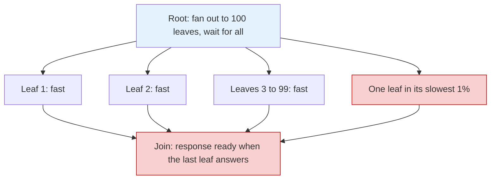

## Purpose

The performance ideas that matter once averages stop being informative: what percentiles measure that means cannot, why queueing variability inflates tails long before utilization hits 1, and why fan-out turns rare slowness into common slowness. The base queueing model this builds on is in [[systems/operating-systems/v2-concurrency/7-queueing-theory|Queueing Theory]] and [[systems/performance/latency-throughput-and-utilization|Latency, Throughput, and Utilization]].

## Percentiles answer a different question than means

A latency distribution in a real service is right-skewed and often multi-modal: a fast path, a cache-miss path, a GC-pause path. The mean blends them into a number no user experiences. [Millsap's framing](https://queue.acm.org/detail.cfm?id=1854041) is that performance questions are experience questions — "how long does *my* task take" — and an average cannot answer them; he recommends stating requirements as percentile specifications ("under 1 second in at least 99.9% of executions"), because "the definition of performance as an average conceals the very problems users complain about."

A quick synthetic example (lognormal with $\sigma = 1$, a million samples, run in the repo venv): mean 1.65, median 1.00, p95 5.19, p99 10.29, p99.9 22.05. The mean sits at the 69th percentile — above what most requests experience, far below what the unlucky ones do. Reporting it answers neither "what is typical" (p50) nor "what do we promise" (p99+). This is why SLOs are stated on percentiles: "p99 < 100 ms over a 28-day window" is checkable and maps to a user population, and the tolerated 1% is the error budget that pays for deploys and hedging load.

## Variance inflates the queue before saturation does

The response-time blowup $R = S/(1-\rho)$ from [[systems/operating-systems/v2-concurrency/7-queueing-theory|Queueing Theory]] is the M/M/1 story. The M/G/1 generalization — Poisson arrivals, *any* service distribution — makes the role of variability explicit. The Pollaczek-Khinchine formula for mean queueing delay:

$$
W_q = \frac{\rho}{1-\rho} \cdot \frac{1 + C_s^2}{2} \cdot S,
$$

where $C_s^2 = \operatorname{Var}[S]/\mathbb{E}[S]^2$ is the squared coefficient of variation of service time. Two separate multipliers: the utilization pole $\rho/(1-\rho)$, and a **variance factor** $(1+C_s^2)/2$. Deterministic service ($C_s^2 = 0$) halves the M/M/1 wait; a heavy-tailed service distribution with $C_s^2 = 10$ waits 5.5x longer than M/M/1 *at identical utilization*. Occasional slow requests — the 100 ms compaction stall among 1 ms lookups — poison the queue for everyone behind them, and no amount of average-utilization headroom fixes a variance problem.

Percentiles inherit the pole. For M/M/1 the response-time distribution is exponential, so the $q$-th percentile is $R_q = -\ln(1-q) \cdot R$: p99 is 4.6x the mean and p99.9 is 6.9x, and since the mean itself scales as $1/(1-\rho)$, tail percentiles explode near saturation at the same rate, multiplied up. Bursty (correlated) arrivals hurt for the same reason: an arrival-side $C_a^2 > 1$ enters the approximation symmetrically, which is the formula-level version of the burst example in [[systems/operating-systems/v2-concurrency/7-queueing-theory|Queueing Theory]].

## Fan-out: rare becomes common

The signature large-system effect, from [Dean and Barroso's *The Tail at Scale*](https://cacm.acm.org/research/the-tail-at-scale/): a root server fans a request out to $n$ leaves and waits for all of them, so the *slowest* leaf sets the response time. If each leaf independently exceeds some threshold with probability $p$,

$$
P(\text{request is slow}) = 1 - (1-p)^n.
$$

Their canonical numbers: a server with 10 ms 99th percentile fans out to 100 servers, and $1 - 0.99^{100} = 63\%$ of requests wait longer than 10 ms — the single-server p99 has become the fleet's *median*. In a measured Google service, a leaf p99 of 10 ms became 140 ms at the root after fan-out, and half of all requests spent their time waiting on the slowest 5% of leaves.



> [!warning] Fan-out amplifies the tail into the median
> With 100 leaves each slow only 1% of the time, $1 - 0.99^{100} = 63\%$ of root requests are slow — a per-server p99 event happens to *most* requests. Engineering the root's p99 therefore means engineering each leaf's p99.99: the tail you must control is two orders of magnitude deeper than the traffic you serve.

The effect reproduces in ten lines (repo venv, same lognormal population; a request's latency is the max over $k$ independent draws):

```python
import numpy as np
rng = np.random.default_rng(0)
lat = rng.lognormal(0.0, 1.0, 1_000_000)      # p50=1.00, p99=10.29

for k in [1, 10, 100]:
    fan = lat[: len(lat) // k * k].reshape(-1, k).max(axis=1)
    print(k, np.percentile(fan, 50).round(2), np.percentile(fan, 99).round(2))
```

Measured: fan-out 1 has p50 = 1.00, p99 = 10.29; fan-out 10 has p50 = 4.47; fan-out 100 has p50 = 11.69, p99 = 41.36. At fan-out 100 the median (11.69) has climbed past the single-server p99 (10.29), matching the $1 - 0.99^{100} \approx 63\%$ arithmetic, and the fleet p99 is now driven by each server's p99.99. Fan-out means the tail you must engineer is two orders of magnitude deeper than the traffic you serve.

Where the per-server variability comes from, per the paper: contention for shared local resources (CPU, caches, disk), background daemons and maintenance (log compaction, GC — they note SSD-internal garbage collection inflating read latency 100x), queueing at multiple layers, power throttling, and global services like distributed locks. Some is removable; the paper's stance is that at scale it never all is, so systems must be built *tail-tolerant*.

## Tail-tolerant techniques

From the same paper, in increasing order of machinery:

- **Hedged requests.** Send the request to one replica; if no reply within the ~95th-percentile latency, send a second to another replica and take the first answer. The extra load is ~5% by construction, while the response now takes the *min* over two draws precisely in the regime where the first draw was slow. Their benchmark: reading 1,000 keys spread over 100 BigTable servers, hedging after 10 ms cut p99.9 from 1,800 ms to 74 ms for 2% additional requests.
- **Tied requests.** Enqueue the request on two servers simultaneously, each knowing the other's identity; whichever dequeues it first cancels its twin. Attacks queueing delay (the dominant variable component) without the hedge's wait, at the cost of cross-server cancellation messages.
- **Micro-partitions and selective replication.** Many more partitions than machines, so load moves in small increments and hot partitions get extra replicas.
- **Latency-induced probation.** Temporarily stop sending to an observed-slow replica (often a machine with an unrelated noisy neighbor), letting it recover while the fleet's tail improves.
- **Good-enough responses and canaries.** Return 99% of leaves' answers rather than waiting for stragglers when result quality tolerates it; canary a request to one leaf before fanning out, to keep untested code paths from taking down every shard at once.

The common thread is statistical: none of these make any server faster; they reshape the distribution the client samples from — min-of-two instead of one draw, avoidance of known-bad draws, tolerance for missing draws. That is the correct mindset once the tail, not the mean, is the product requirement.

## Related notes

- [[systems/performance/latency-throughput-and-utilization|Latency, Throughput, and Utilization]]
- [[systems/operating-systems/v2-concurrency/7-queueing-theory|Queueing Theory]]
- [[systems/scheduling/0-foundations/queueing-models-and-tail-latency|Queueing Models and Tail Latency]]
- [[systems/distributed-systems/load-balancing|Load Balancing]]

## Sources

- [Dean and Barroso (2013), The Tail at Scale, CACM 56(2)](https://cacm.acm.org/research/the-tail-at-scale/)
- [Millsap (2010), Thinking Clearly about Performance, ACM Queue](https://queue.acm.org/detail.cfm?id=1854041)
- [Brewer, CS262 queueing theory notes](https://people.eecs.berkeley.edu/~brewer/cs262/queueing.pdf)
