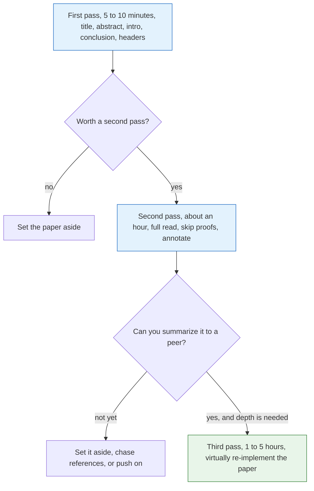

## Purpose

Summary of [Keshav's "How to Read a Paper"](https://web.stanford.edu/class/cs114/reading-keshav.pdf). I keep this next to my paper reviews as the method behind them.

## Problem

Researchers spend hundreds of hours reading papers every year, so they ought to know how to do it effectively. Keshav argues that reading a paper is a learnable skill, and one that school never teaches.

## The three-pass approach

Each pass ends with a decision about whether the paper deserves the next one:

### First pass

Gives you a general idea of what the paper is about. Read the title, abstract, introduction, and conclusion. Only read section and sub-section headers. Also glance over the references and note which you've read. This should only take 5-10 minutes.

After the first pass, you should be able to answer the five Cs:

- *Category*: What type of paper is this? (e.g. measurement, analysis)
- *Context*: Which other papers is it related to? What is the theoretical background?
- *Correctness*: Do the assumptions appear to be valid?
- *Contributions*: What are the paper's main contributions?
- *Clarity*: Is the paper well written?

### Second pass

Grasp the content of the paper, but not necessarily the details. Read the whole thing, but ignore things like proofs. It helps to annotate and take notes during this pass. Pay special attention to diagrams, and mark relevant unread references. This should take about an hour.

After this pass, you should be able to summarize the paper in a few sentences to a peer. If you still don't understand, you can do one of three things:

- Set the paper aside and hope
- Come back to the paper later after looking up references you didn't understand
- Continue to the third pass anyways 😢

### Third pass

Understand the paper in depth. You should *virtually re-implement* the paper, following all reasoning and challenging every assumption. Also try to think about how you would have presented the information differently, and note potential follow-up work as you go. This takes up to 5 hours, and at least 1 hour for a well-written paper and a well-read reader.

After this pass, you should be able to reconstruct the paper's structure from memory, critique it, and pinpoint implicit assumptions, limitations, and potential improvements.

## Sources

- [How to Read a Paper](https://web.stanford.edu/class/cs114/reading-keshav.pdf)

## Related notes

- [[systems/research/paper-review-template|Paper Review Template]]
- [[systems/research/strong-inference|Strong Inference]]
