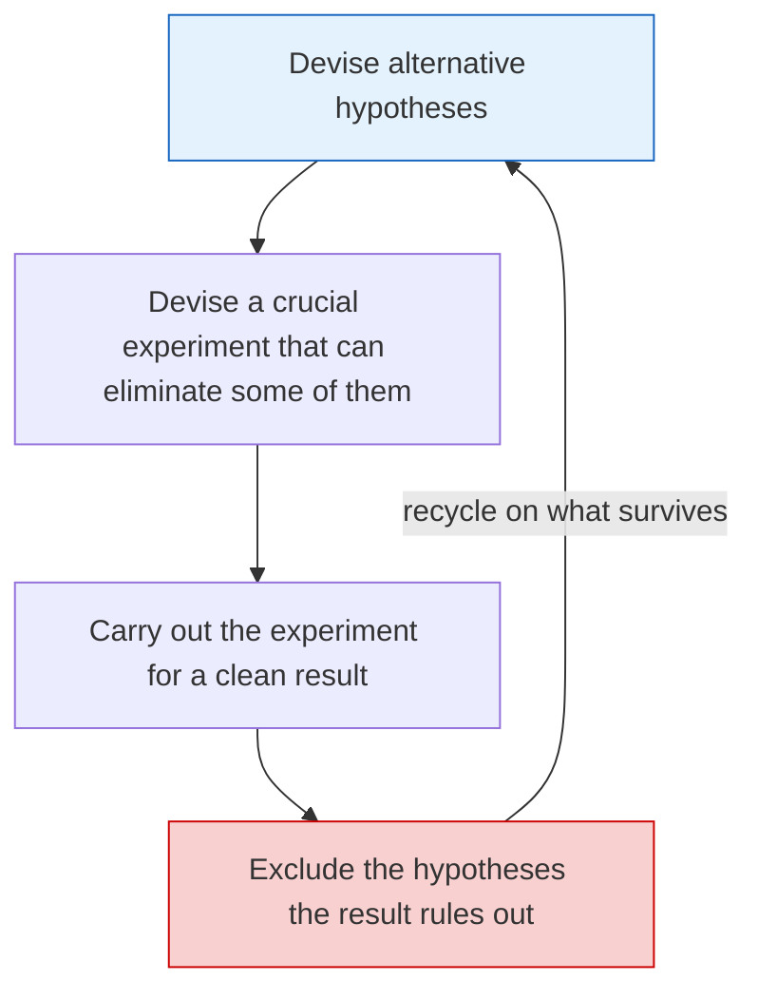

## Purpose

Reading notes on Platt's Strong Inference. I keep this next to [[systems/research/how-to-read-a-paper|How to Read a Paper]] as part of the method behind my paper reviews, since both are about doing research deliberately instead of by habit.

## Citation

- [Strong Inference: Certain systematic methods of scientific thinking may produce much more rapid progress than others](https://pages.cs.wisc.edu/~markhill/science64_strong_inference.pdf), John R. Platt, Science, 1964.

## Problem

Research practice has become less standardized in some fields, especially compared to the structured approach of molecular biology and high-energy physics. When researchers stop adhering to a formal method, particularly when formulating hypotheses, the work gets less efficient and progress slows.

## Main idea

Platt argues the fast-moving fields move fast because they apply the scientific method with unusual discipline, and he names that discipline strong inference. The loop:

1. **Devise alternative hypotheses.** Generate multiple competing hypotheses that could explain the phenomenon.
2. **Devise a crucial experiment.** Design an experiment that can unambiguously distinguish between the hypotheses, or at least eliminate some of them.
3. **Carry out the experiment.** Run it and analyze the results.

Strong inference means running this loop at every vertex of the logical tree of inquiry, systematically. Platt suggests keeping a notebook explicitly for it, and paying particular attention to the hypothesis generation step. The paper spends much of its length on historical examples of the method working in practice, plus a detailed breakdown of applying it.

> [!quote] The two questions worth asking constantly
> "How would we know this hypothesis is wrong?" and "What hypothesis does this experiment disprove?"

## Why it works

Deviations from strong inference show up as delays. A lot of scientific busywork exists because the researcher never spent the time up front formulating hypotheses that experiments could kill. Done correctly, the method approaches the minimum amount of work needed to make a discovery without getting lucky.

The whole thing hinges on the induction step. The competing hypotheses have to be logically sound and actually span the possibilities, or the crucial experiment eliminates nothing.

## Sources

- [Strong Inference](https://pages.cs.wisc.edu/~markhill/science64_strong_inference.pdf)

## Related notes

- [[systems/research/how-to-read-a-paper|How to Read a Paper]]
- [[systems/research/paper-review-template|Paper Review Template]]
