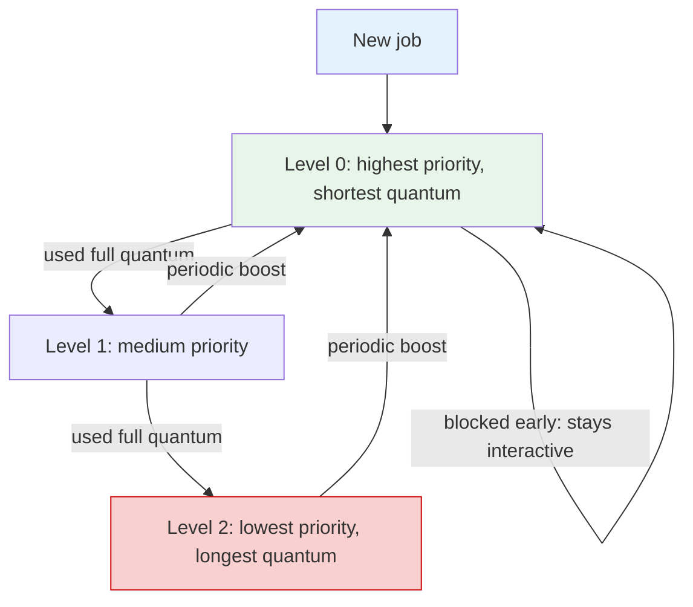

## Purpose

This note is the map of single-resource schedulers. A lot of policies differ only in what objective they are secretly optimizing:

- mean completion time
- fairness
- response time for interactive jobs
- bounded starvation
- deadline satisfaction

## One Workload, Many Objectives

Take jobs with arrival times $a_i$ and service requirements $p_i$ on one server. A scheduler chooses which runnable job gets the processor next.

Useful objectives:

- mean response time
- mean completion time
- tail latency
- fairness
- starvation bounds
- scheduling overhead

No single policy wins all of them.

## FIFO

First-in, first-out is the simplest policy:

```python
ready_q.append(job)
job = ready_q.popleft()
run_to_completion(job)
```

Good:

- minimal policy overhead
- good throughput when jobs are similar
- predictable implementation

Bad:

- convoy effect: one long job delays many short ones
- terrible interactive latency under mixed workloads

FIFO is often the right baseline because every fancier policy must beat its simplicity honestly.

## SJF and SRPT

Shortest Job First (non-preemptive) and Shortest Remaining Processing Time (preemptive) chase mean response time aggressively.

The exchange argument is the core intuition. If two adjacent jobs have sizes $p_i > p_j$, running $j$ before $i$ changes the sum of completion times by

$$
(p_j + p_i) - (p_i + p_j) = 0
$$

for the pair's total finish horizon, but the earlier completion of the short job reduces the total waiting borne by downstream jobs. Repeatedly swapping inversions leads to shortest-first order.

SRPT is stronger: when a short job arrives, preempt the long one if the new job's total remaining time is smaller.

Good:

- optimal mean response time in the idealized single-server setting

Bad:

- needs job-size knowledge or prediction
- can starve long jobs
- users can game it by splitting work

## Processor Sharing and Round Robin

Round robin approximates processor sharing with quantum $q$:

```python
while ready_q:
    job = ready_q.popleft()
    run(job, quantum=q)
    if not job.done:
        ready_q.append(job)
```

As $q \to 0$ and context-switch cost goes to zero, RR approaches fluid processor sharing. Every runnable job gets the same instantaneous share.

That makes RR attractive for fairness, but not for mean completion time. Compared with SRPT:

- long jobs start earlier
- short jobs finish later
- overhead rises as $q$ shrinks

RR is a policy for "nobody waits forever", not "the average job finishes early."

## MLFQ

Multi-level feedback queue is the classic heuristic for unknown job sizes.

Idea:

- new jobs start at high priority
- if a job consumes its whole quantum, demote it
- if it blocks early, keep it high
- periodically age or boost jobs to limit starvation

This approximates "short and interactive jobs first" without oracle knowledge of runtime.



```python
for level in priority_levels:
    if level.ready:
        job = level.ready.popleft()
        run(job, quantum[level])
        if job.done:
            finish(job)
        elif job.used_full_quantum:
            demote(job)
        else:
            keep_or_promote(job)
        break
```

MLFQ is a practical compromise, not an optimality theorem.

## One Tiny Trace

Jobs arrive at time 0 with sizes:

$$
p = [8, 4, 1]
$$

FIFO completion times:

$$
[8, 12, 13]
$$

mean completion time:

$$
\frac{8+12+13}{3} = 11
$$

SJF completion times:

$$
[1, 5, 13]
$$

mean completion time:

$$
\frac{1+5+13}{3} \approx 6.33
$$



```mermaid
gantt
    dateFormat X
    axisFormat %s
    section FIFO
    J1 size 8 :0, 8
    J2 size 4 :8, 12
    J3 size 1 :crit, 12, 13
    section SJF
    J3 size 1 :0, 1
    J2 size 4 :1, 5
    J1 size 8 :5, 13
```

RR with $q=1$ is fairer in start time but worse than SJF in mean completion time because the size-1 job keeps revisiting the queue instead of just finishing immediately.

## What to Remember

- FIFO optimizes implementation simplicity.
- SJF/SRPT optimize mean response time.
- RR approximates equal sharing.
- MLFQ is the heuristic that tries to look like SJF without knowing job size.

Whenever someone argues about "best scheduler", ask which objective they mean.

## Related Notes

- [[systems/operating-systems/v2-concurrency/7-uniprocessor-scheduling|Uniprocessor Scheduling]]
- [[systems/scheduling/1-single-resource/real-time-scheduling-edf-and-rate-monotonic|Real-Time Scheduling]]
- [[systems/scheduling/2-parallel-and-multiprocessor/work-stealing-affinity-and-numa|Work Stealing, Affinity, and NUMA]]

