## Purpose

Most scheduling notes optimize averages. Real-time scheduling changes the question:

- does every job finish before its deadline?

That is a feasibility question before it is a performance question.

## Task Model

For periodic task $\tau_i$:

- computation time $C_i$
- period $T_i$
- relative deadline $D_i$

The simplest classical setting uses implicit deadlines:

$$
D_i = T_i
$$

Utilization is

$$
U = \sum_i \frac{C_i}{T_i}
$$

The model comes from [Liu and Layland (1973)](https://people.eecs.berkeley.edu/~culler/cs252-s05/papers/liu-layland.pdf), whose assumptions are worth stating because every clean theorem below depends on them: tasks are periodic and independent, deadlines coincide with periods, worst-case execution times are known, preemption is free, and there is one processor. A **critical instant** — the release pattern producing a task's worst response time — occurs when a task is released simultaneously with all higher-priority tasks (their Theorem 1), which is why all the analyses check the synchronous release case only.

## Earliest Deadline First

EDF is dynamic priority scheduling:

- among runnable jobs, run the one whose absolute deadline is soonest

In the implicit-deadline uniprocessor model, EDF is optimal. If any policy can schedule the task set feasibly, EDF can.

A necessary feasibility condition is

$$
U \le 1
$$

and for implicit deadlines on one processor this is also sufficient for EDF (Liu and Layland, Theorem 7).

The optimality intuition is an exchange argument, the same one that proves SRPT optimal for mean response time: take any feasible schedule and find the first time it runs a job whose deadline is later than some other ready job's. Swapping the next unit of execution between them keeps both jobs feasible — the earlier-deadline job finishes sooner, and the later-deadline job inherits a slot that still precedes its (later) deadline. Repeated swaps transform any feasible schedule into the EDF schedule without introducing a miss, so if EDF misses a deadline, no policy avoids it. The $U \le 1$ sufficiency then follows because EDF wastes no capacity: the processor idles only when no work exists.

## Rate Monotonic

Rate monotonic (RM) is fixed priority:

- shorter period means higher priority

It is easier to implement than EDF because priorities are static. The classic utilization bound is

$$
U \le n(2^{1/n} - 1)
$$

for $n$ tasks.

As $n \to \infty$, this approaches

$$
\ln 2 \approx 0.693
$$

So RM has a safe utilization bound around 69.3% in the worst case, even though many concrete task sets above that are still schedulable. The bound is tight in the sense that task sets exist just above it that RM cannot schedule, but it is only *sufficient*: failing the bound proves nothing. The priority assignment itself is provably the best fixed one — Liu and Layland show that if *any* fixed-priority assignment schedules a task set, rate-monotonic order does (Theorem 2), so RM's capacity gap versus EDF is the cost of fixing priorities at all, not of choosing them badly.

> [!warning] The two utilization tests make different kinds of claim
> EDF's $U \le 1$ is exact for implicit deadlines: pass means schedulable, fail means no policy can schedule the set. RM's $n(2^{1/n}-1) \to 0.693$ bound is *sufficient only* — a task set failing it may still be schedulable under RM, and the response-time analysis below is the exact test. The gap between 0.693 and 1.0 is the capacity price of fixing priorities statically.

### Response-Time Analysis

The exact fixed-priority test (beyond the pessimistic bound) computes each task's worst-case response time as a fixed point. For task $i$ with higher-priority tasks $j$:

$$
R_i = C_i + \sum_{j \in hp(i)} \left\lceil \frac{R_i}{T_j} \right\rceil C_j
$$

iterated from $R_i = C_i$ until it converges (schedulable if $R_i \le D_i$) or exceeds the deadline. The ceiling term counts how many times each higher-priority task preempts during the window. This test is exact under the model assumptions, and it handles $D_i < T_i$ cases the utilization bound cannot.

## The Separating Example

The cleanest way to see the RM/EDF gap is a task set between the two bounds: $\tau_1 = (C{=}2, T{=}5)$, $\tau_2 = (C{=}4, T{=}7)$, so $U = 2/5 + 4/7 = 0.971$ — above RM's 0.828 bound, below EDF's 1.0. Simulated over the hyperperiod of 35 ticks (repo venv; simulator releases jobs at period boundaries and picks by policy each tick):

```plaintext
RM:  1122211222112.211222...   tau2 MISSES at t=7
EDF: 11222211222211211222...   no misses over the full hyperperiod
```

Under RM, $\tau_1$'s release at $t=5$ preempts $\tau_2$ (fixed priority: shorter period wins), leaving $\tau_2$ only 5 of the 7 ticks before its deadline — it needs $4 + \lceil R/5 \rceil \cdot 2$ and the response-time recurrence diverges past 7 ($R_2$ iterates $4 \to 6 \to 8 > 7$: unschedulable, confirming the trace). Under EDF, at $t=5$ the running $\tau_2$ has deadline 7 while the newly released $\tau_1$ has deadline 10, so $\tau_2$ *keeps the processor* — dynamic priority makes exactly the decision fixed priority cannot, and the set is schedulable at 97% utilization.

The first eight ticks, drawn — the divergence is the single decision at $t=5$:

```mermaid
gantt
    dateFormat X
    axisFormat %s
    section RM tau1
    job 1 :0, 2
    job 2 :5, 7
    section RM tau2
    3 of 4 ticks :2, 5
    deadline 7 missed :crit, 7, 8
    section EDF tau1
    job 1 :0, 2
    job 2 :6, 8
    section EDF tau2
    job 1 :2, 6
```



## Small Example

Take two periodic tasks:

- $\tau_1: C_1 = 1, T_1 = 4$
- $\tau_2: C_2 = 2, T_2 = 5$

Then

$$
U = \frac{1}{4} + \frac{2}{5} = 0.65
$$

EDF says feasible because $U < 1$.

RM bound for $n=2$ is

$$
2(\sqrt{2}-1) \approx 0.828
$$

So RM's sufficient bound also passes. Both are safe here.

## Why EDF Wins Theoretically and RM Persists Practically

EDF uses dynamic priorities and fully exploits available utilization in the classical model. RM gives up capacity in exchange for simpler implementation and analyzability under many embedded-system assumptions.

The real system tradeoff is often:

- EDF: more flexible, tighter capacity use
- RM: simpler fixed-priority machinery, easier certification story

## Tiny Schedulability Helper

```python
import math

def rm_bound(n: int) -> float:
    return n * (2 ** (1 / n) - 1)

def utilization(tasks):
    return sum(c / t for c, t in tasks)

tasks = [(1, 4), (2, 5)]
u = utilization(tasks)
print("U =", u)
print("EDF feasible?", u <= 1.0)
print("RM sufficient test?", u <= rm_bound(len(tasks)))
```

## Hard Real-Time Is Not Low Latency

The two goals are routinely conflated and are close to opposites in method:

| | Hard real-time (EDF/RM) | Interactive low latency (MLFQ/EEVDF) |
| --- | --- | --- |
| Question | does *every* job meet its deadline? | are *most* responses fast? |
| Failure | one miss = system failure | a slow p99 = degraded, not broken |
| Analysis | offline schedulability proof from worst cases | online measurement of distributions |
| Load | admission-controlled to proven-feasible sets | best effort at any load |
| Optimizes | feasibility, then nothing else | means and percentiles |

A hard real-time system happily runs a task set with terrible average latency, provided the proofs hold; an interactive scheduler happily misses any individual "deadline," provided the tail stays acceptable. The engineering split follows: real-time systems buy predictability (WCET analysis, lock-free or priority-inheritance protocols, cache partitioning) while interactive systems buy adaptivity. Linux carries both: `SCHED_DEADLINE` is a bandwidth-enforced EDF class sitting above the fair-share scheduler, admission-tested on declared $(C, D, T)$ per task, while ordinary threads get EEVDF's soft-latency treatment ([[systems/operating-systems/v2-concurrency/7-multiprocessor-scheduling|multiprocessor scheduling]]).

## Caveats

The clean theorems above assume a lot:

- one processor
- independent tasks
- no shared-resource blocking
- known worst-case execution times
- periodic or sporadic release models

Once locks, I/O, multicore interference, or cache effects show up, schedulability analysis gets much messier. The classic hazard is **priority inversion** — a high-priority task blocked on a lock held by a low-priority task that a medium-priority task keeps preempting; the Mars Pathfinder reset loop is the canonical incident, and priority inheritance is the standard mitigation. Every relaxation of the assumptions (deadlines shorter than periods, jitter, blocking terms) has a corresponding extension of the response-time test; the recurrence above is the base case of a large literature.

## Related Notes

- [[systems/operating-systems/v2-concurrency/7-multiprocessor-scheduling|Multiprocessor Scheduling]]
- [[systems/scheduling/1-single-resource/fifo-sjf-srpt-rr-and-mlfq|FIFO, SJF, SRPT, RR, and MLFQ]]
- [[systems/scheduling/0-foundations/queueing-models-and-tail-latency|Queueing Models and Tail Latency]]

