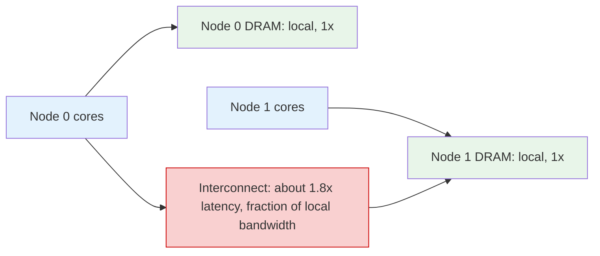

## Purpose

On a NUMA machine the scheduler's cost model acquires a second dimension: not just *which CPU is free* but *where this thread's memory lives*. A scheduler that balances runnable-thread counts perfectly while ignoring placement can produce a machine that is uniformly busy and uniformly slow — every thread running far from its pages, every miss crossing the interconnect. This note covers the mechanics (thread affinity, page placement, migration) and the policy tension (locality versus balance versus fairness). The migration-cost hierarchy it plugs into is in [[systems/operating-systems/v2-concurrency/7-multiprocessor-scheduling|multiprocessor scheduling]]; the task-parallel view is in [[systems/scheduling/2-parallel-and-multiprocessor/work-stealing-affinity-and-numa|work stealing, affinity, and NUMA]].

## The Cost Asymmetry

A multi-socket machine is a network of nodes, each a package of cores with its own memory controller and local DRAM, joined by a cache-coherent interconnect (QPI/UPI, Infinity Fabric). Local access goes through the on-package controller; remote access crosses the link, adding latency and contending for link bandwidth. Representative numbers: [Lameter's Queue article](https://queue.acm.org/detail.cfm?id=2513149) puts the remote penalty for a 2017-era two-socket Intel system at roughly **1.8x local latency**, with earlier SMP interconnects far worse; [Drepper](https://www.akkadia.org/drepper/cpumemory.pdf) measured read latency growing steadily with hop count on multi-hop AMD topologies (1.2-1.5x one hop, approaching 2x at two). Bandwidth divides the same way — the interconnect's capacity is a fraction of aggregate local DRAM bandwidth, so remote-heavy workloads saturate the link long before the memory controllers. The single-socket ceiling that motivates multi-threaded bandwidth in [[systems/operating-systems/benchmarks/bandwidth|the bandwidth benchmark]] gets a second, lower ceiling for remote traffic; the [[systems/operating-systems/benchmarks/mlp|MLP benchmark's]] overlap arithmetic also degrades, since each outstanding remote miss occupies its miss-handling slot longer.

The scheduling-relevant shape: the penalty is per-access and *persistent*. A thread migrated across sockets does not pay a one-time cost like a cache refill; it pays ~1.5-2x on every miss until its pages move too. That is what makes NUMA placement a scheduling problem rather than a warmup problem.

## Why CPU Balance Alone Fails

The failure mode is mechanical. First-touch allocation (the default: a page lands on the node of the CPU that first writes it) means a thread's pages accumulate wherever it starts running. Now let the load balancer see socket 0 with five runnable threads and socket 1 with three: it migrates two threads across. CPU utilization equalizes; the migrated threads' entire working sets are now remote; throughput can *fall* even as the machine looks better balanced. Worse, the balancer has no idea which two threads to pick — the right choice is the pair with the smallest live working sets, information the runqueue does not carry.

Two canonical traps compound it:

- **The migrated-parent trap**: a process starts on node 0, allocates its heap (first-touch: node 0), then gets balanced to node 1. Every child thread it spawns starts on node 1, but the shared heap stays remote forever.
- **The zero-page-init trap**: a single thread initializes a large array (all pages land on its node), then a parallel phase reads it from every node — one memory controller serves the whole machine while three idle. The fix is initializing in parallel with the same partitioning the compute phase will use, which is application-level scheduling of *pages*, not threads.

## The Mechanism Toolbox

**Thread affinity.** Pin threads to nodes (`sched_setaffinity`, `numactl --cpunodebind`), or let the scheduler's NUMA domains do soft placement. Pinning gives predictability at the price of the load-imbalance failures affinity always risks.

**Page placement policy.** The [kernel's NUMA memory policies](https://www.kernel.org/doc/html/latest/admin-guide/mm/numa_memory_policy.html): `default` (first-touch/local), `bind` (restrict to nodes, fail otherwise), `preferred` (try one node, fall back), and `interleave` (round-robin pages across nodes). Interleave deliberately sacrifices best-case locality for *uniform* mediocrity — every access averages the topology — which wins for shared structures accessed evenly from everywhere (page caches, big hash tables), because it converts a hot-controller bottleneck into spread load.

**Page migration.** Move the data to the compute: explicit (`migrate_pages`, `move_pages`) or automatic. Linux's **AutoNUMA** balancing periodically unmaps pages and uses the resulting minor faults as a sampling probe — fault from a remote node repeatedly, and the page migrates toward the accessor (or the task migrates toward its pages; the kernel weighs both). The probing and copying are overhead spent on a bet about future access patterns; for workloads whose access patterns shift faster than the sampling converges, AutoNUMA loses its wager, which is why databases and JVMs commonly disable it and place explicitly.

**Replication.** Read-mostly data can simply exist on every node (per-node copies of lookup tables, text segments). The kernel replicates its own read-only data this way; applications do it with per-node caches, paying memory for locality.

## Locality vs. Fairness vs. Utilization

Three tensions drive placement policy:

- **Locality vs. utilization**: leaving a core idle on node 1 rather than migrating a node-0 thread to it preserves locality and wastes capacity; the break-even depends on the thread's miss rate and working-set size. Linux encodes the reluctance structurally — load balancing across NUMA domains runs less often and demands larger imbalance than within-socket balancing — a static compromise standing in for the per-thread calculation nobody can do cheaply.
- **Locality vs. fairness**: a fair scheduler in the [[systems/scheduling/3-network-and-packet/fair-queueing-wfq-and-drr|max-min sense]] equalizes CPU time, but equal CPU time at unequal memory distance is unequal *progress* — a remote-running thread does less work per cycle awarded. True fairness on NUMA would need to account cycles weighted by achieved IPC, which no mainstream scheduler attempts; the practical proxy is keeping placement stable enough that the distortion stays small.
- **Packing vs. spreading**: memory-bandwidth-bound threads should spread across nodes (each gets its own controller — the scaling logic of the bandwidth benchmark), while communication-heavy or cache-sharing threads should pack onto one (coherence traffic stays on-package, as in the [[systems/operating-systems/benchmarks/false_sharing|false sharing benchmark]]). The same two workloads thus want opposite placements, and a scheduler that cannot classify them must guess; gang-scheduled parallel jobs make the guess explicit by requesting a topology.

The cluster-level echo: datacenter schedulers face the identical structure one level up — [[systems/scheduling/4-cluster-and-datacenter/cluster-scheduling-and-dominant-resource-fairness|placement quality versus queue fairness]] — with rack locality standing in for socket locality. NUMA is the smallest instance of the general rule that once data has a location, scheduling compute is also scheduling data movement.

## Diagnosing Placement Problems

The signature of a NUMA problem is high memory latency with unremarkable CPU metrics — the machine is busy, IPC is low, and nothing is saturated except (invisibly, unless measured) the interconnect. The direct probes: `numastat` reports per-node hit/miss/foreign counters, so a climbing `numa_miss` under load is remote traffic made visible; hardware counters (`perf stat -e node-loads,node-load-misses`, or the offcore-response events) attribute remote accesses to code; `numactl --hardware` shows the topology and per-node free memory (a full node forces remote allocations regardless of policy). The standard experiment is also the cheapest: run the workload under `numactl --cpunodebind=0 --membind=0` and compare against unpinned — if single-node pinning at *lower* nominal parallelism beats the free-running configuration, the balancer is losing to the topology, and explicit placement will pay.

## Related Notes

- [[systems/operating-systems/v2-concurrency/7-multiprocessor-scheduling|Multiprocessor Scheduling]]
- [[systems/scheduling/2-parallel-and-multiprocessor/work-stealing-affinity-and-numa|Work Stealing, Affinity, and NUMA]]
- [[systems/operating-systems/benchmarks/bandwidth|Memory Bandwidth Benchmarks]]
- [[systems/operating-systems/benchmarks/mlp|Memory-Level Parallelism Benchmarks]]
- [[systems/operating-systems/benchmarks/false_sharing|False Sharing Benchmarks]]

## Sources

- [Lameter (2013), NUMA (Non-Uniform Memory Access): An Overview, ACM Queue 11(7)](https://queue.acm.org/detail.cfm?id=2513149)
- [Linux kernel docs, NUMA Memory Policy](https://www.kernel.org/doc/html/latest/admin-guide/mm/numa_memory_policy.html)
- [Drepper (2007), What Every Programmer Should Know About Memory](https://www.akkadia.org/drepper/cpumemory.pdf)
- [LWN, Memory part 4: NUMA support](https://lwn.net/Articles/254445/)
