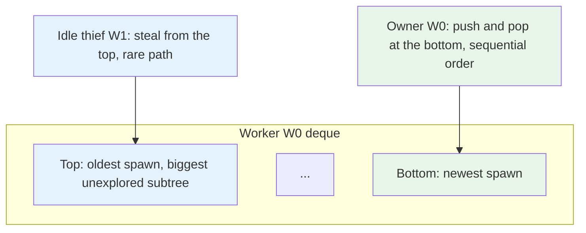

## Purpose

Single-queue scheduling stops being adequate on multicore machines because a good placement policy has to reason about both load and locality. This note covers three pieces that fit together:

- work stealing for irregular task graphs
- processor affinity for cache reuse
- NUMA awareness for memory locality

## Work and Span

For a parallel computation DAG:

- $T_1$: total work, the time on one processor
- $T_\infty$: span, the critical-path time with infinite processors

No scheduler can beat

$$
T_P \ge \max\left(\frac{T_1}{P}, T_\infty\right)
$$

Work stealing matters because it gets close to that lower bound for well-structured computations without centralized scheduling.

## The Deque Discipline

Each worker owns a double-ended queue:

- owner pushes and pops from the bottom
- thieves steal from the top

That asymmetry is the trick.

- Bottom operations are cheap and local in the common case.
- Old work near the top tends to expose more parallel slack, so stealing there is useful.

```python
class Worker:
    def __init__(self):
        self.deque = []

    def spawn(self, task):
        self.deque.append(task)        # push bottom

    def run_local(self):
        return self.deque.pop() if self.deque else None

    def steal_from(self, victim):
        return victim.deque.pop(0) if victim.deque else None
```

Real runtimes avoid `pop(0)` because it is linear in Python lists, but the policy is the point.



There is a second, quieter argument for this exact discipline: the owner's bottom-LIFO order is *the sequential execution order*. A worker that never gets robbed executes the DAG exactly as a single-threaded program would — same order, same cache behavior, same stack depth. This is the **work-first principle** from the [Cilk-5 papers](https://dl.acm.org/doi/10.1145/277650.277725): put the scheduling overhead on the *steal* path, not the *spawn* path, because in a well-parallelized program spawns happen $T_1$ times but steals happen only $O(P \cdot T_\infty)$ times. Cilk's implementation makes a spawn cost only a few instructions more than a function call, while a steal pays for locks, continuation packaging, and cache misses — the rare path absorbs the cost. The same asymmetry shows up as *continuation stealing* (Cilk: the thief takes the caller's continuation, the owner keeps executing the child it just spawned, depth-first) versus *child stealing* (TBB, ForkJoinPool: the spawned child is queued and the owner continues in the caller; simpler to implement in a library without compiler support, at the cost of unbounded queue growth in pathological spawn patterns).

## A DAG and Its Trace

Recursive Fibonacci is the standard toy DAG because it is maximally irregular: `fib(n)` spawns `fib(n-1)` and `fib(n-2)`, subtree sizes differ exponentially, and no static partition balances them. A 3-worker trace of `fib(4)`, unit-cost nodes, W0 starting with the root:

```plaintext
tick  W0                    W1                    W2
1     fib(4): spawn 3,2     idle -> steal fib(3)? no work yet   idle
2     pop fib(2) (bottom)   steal fib(3) (top of W0)            idle
3     fib(2): spawn 1,0     fib(3): spawn 2,1     steal fib(2) (top of W1)
4     pop fib(0) -> 0       pop fib(1) -> 1       fib(2): spawn 1,0
...
```

The shape to notice: W0's *bottom* pops walk depth-first down the small subtree (sequential order), while thieves take from the *top* — the oldest spawn, the biggest unexplored subtree (`fib(3)` rather than `fib(1)`) — so one steal buys a thief a long run of local work. Steal frequency is what the theorem says it should be: rare when the deques are deep.

A complete toy runtime (workers as round-robin ticks, random victims, bottom-pop/top-steal, continuation bookkeeping via join counters) is small enough to run and measure — the results below are from the repo venv on `fib(10)`, 177 unit tasks:

| Workers | ticks | steals | speedup |
| --- | --- | --- | --- |
| 1 | 177 | 0 | 1.0 |
| 2 | 92 | 6 | 1.92 |
| 4 | 49 | 17 | 3.61 |

Near-linear speedup with steals under 10% of tasks: the $T_1/P$ term dominating, as the bound predicts for a DAG whose parallelism ($T_1/T_\infty \approx 177/\text{depth} \approx 20$) exceeds $P$. The core of the implementation:

```python
kind, arg, parent = self.deques[w].pop()      # owner: bottom (LIFO)
...
task = self.deques[victim].pop(0)             # thief: top (FIFO)
self.deques[w].append(task)
```

plus a join counter per spawn point (`[children_pending, accumulator, parent]`) that fires the continuation when the last child completes. Production runtimes replace the list with a **Chase-Lev deque** — a lock-free circular array where owner and thief touch opposite ends and a compare-and-swap is needed only when they race for the last element.

## Why Work Stealing Works

The Blumofe-Leiserson result is the headline:

$$
E[T_P] = O\left(\frac{T_1}{P} + T_\infty\right)
$$

for fully strict computations under randomized stealing.

The intuition is clean:

- busy workers keep chewing through local work
- idle workers steal only when parallelism exists elsewhere
- steals are charged mostly to the critical path rather than to all work

That is why task-parallel runtimes often prefer work stealing to one global queue.

## The Same Design, Shipped Five Times

The pattern's ubiquity is its best endorsement, and the variations are informative:

- **Cilk / Cilk Plus**: the reference design — compiler-supported continuation stealing, work-first, randomized victims. The theorem's home.
- **Intel TBB** and **Java ForkJoinPool**: library implementations with child stealing; ForkJoinPool adds *help-first* joining (a worker blocked on a join steals its own descendants' work rather than idling).
- **Rust rayon**: TBB-shaped, with `join(a, b)` as the primitive and scope-based lifetimes making the deque discipline memory-safe.
- **Go runtime**: goroutines in per-P local run queues with bottom-LIFO/top-steal, plus a global queue and network poller integration; steals take *half* the victim's queue, trading steal frequency against balance granularity.
- **Linux CFS/EEVDF** is the contrast case: per-CPU queues with periodic load balancing rather than stealing, because kernel threads are long-lived and priority-bearing rather than short cooperative tasks — which marks the boundary of work stealing's applicability: it assumes tasks are plentiful, short, and interchangeable in priority. Deadline or priority scheduling across jobs needs different machinery ([[systems/scheduling/1-single-resource/real-time-scheduling-edf-and-rate-monotonic|EDF and rate-monotonic]]).

## Affinity

Even for sequential request processing, where work stealing is not the main idea, affinity matters. If a thread runs again on the same core:

- its private caches are more likely to help
- branch predictor state is warmer
- TLB entries are likelier to still matter

The scheduler objective is no longer just "which core is idle?" It becomes:

- is the work runnable?
- where is its state warm?
- what is the cost of moving it?

This is why per-core run queues are common.

## NUMA

On a NUMA machine, memory has topology. Local DRAM and remote DRAM do not cost the same. So thread placement and page placement become coupled problems.

The wrong move is to "balance" CPU load by moving a thread away from the memory it mostly touches. CPU utilization can improve while response time gets worse.

The actual cost model includes:

- migration cost of moving the runnable thread
- cache-warmup loss after migration
- remote-memory penalty if the thread stays but data moves badly

That is why real multiprocessor scheduling often accepts some load imbalance to preserve locality.

## When Work Stealing and Affinity Fight

Work stealing wants idle processors to grab tasks aggressively. Affinity wants tasks to stay near their data. These objectives line up when:

- steal only when local work is exhausted
- steal coarse enough tasks that the extra locality loss is amortized

They fight when tasks are tiny or data-heavy. Then a "balanced" schedule can become a locality disaster.

## Related Notes

- [[systems/operating-systems/v2-concurrency/7-multiprocessor-scheduling|Multiprocessor Scheduling]]
- [[systems/operating-systems/benchmarks/bandwidth|Memory Bandwidth]]
- [[systems/operating-systems/benchmarks/false_sharing|False Sharing]]
- [[systems/operating-systems/benchmarks/mlp|Memory-Level Parallelism]]

