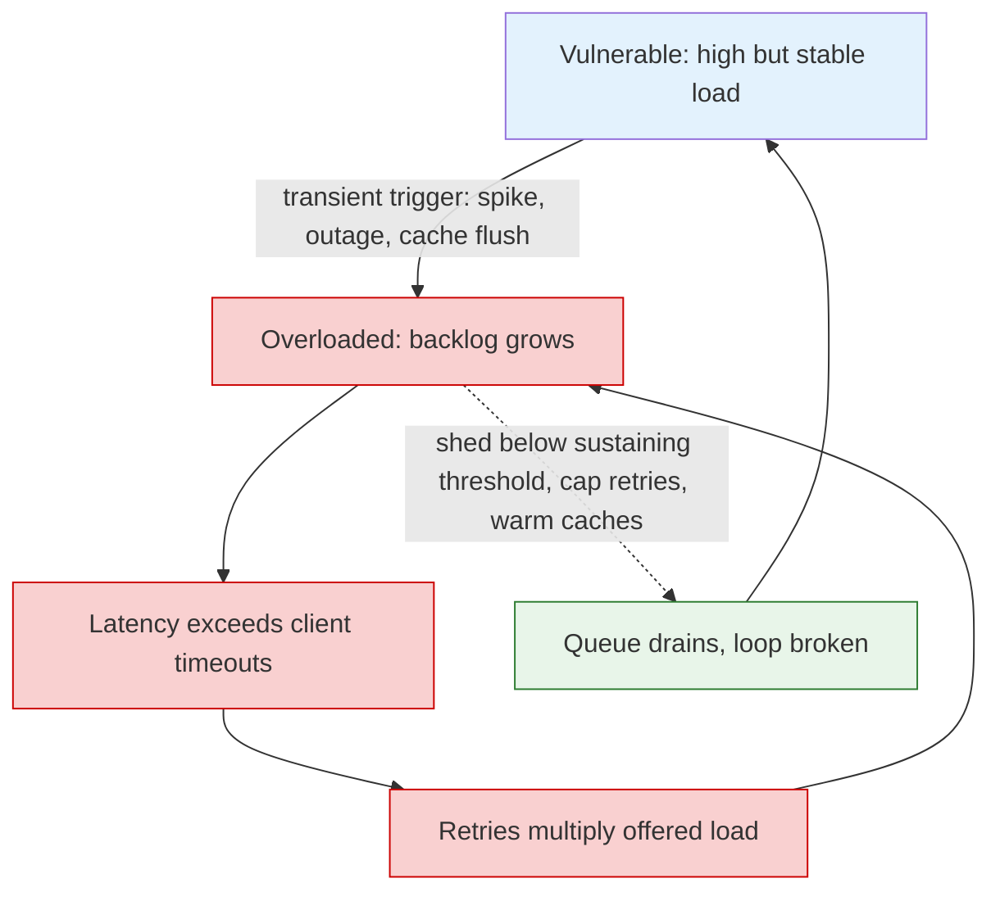

## Purpose

Every policy in this section decides which queued task runs next. This note is about the decision before that one: whether work should enter the queue at all. Past saturation, the steady-state queueing math in [[systems/scheduling/0-foundations/queueing-models-and-tail-latency|queueing models and tail latency]] stops applying and starts describing a backlog growing without bound — and the scheduling problem becomes choosing what to refuse, how to signal upstream, and how to avoid the failure modes where overload sustains itself.

## Goodput is the objective, not throughput

**Goodput** is work completed in time to be useful — before the client's deadline, still wanted by the caller. Throughput without that qualifier is a vanity metric under overload: a server can be 100% busy producing answers nobody is waiting for. A saturated system serving each request after its caller timed out has full throughput and zero goodput, and it does so at full price, which is why the [SRE book's overload chapter](https://sre.google/sre-book/handling-overload/) is organized around the principle that serving errors quickly beats serving successes slowly.

The mechanism is worth simulating rather than asserting. A server with capacity $\mu = 1000$ req/s receives $\lambda = 1500$ req/s; clients time out after 1 s. Two configurations, run for 60 s (repo venv; event-driven at 1 ms ticks):

| | served/s | goodput/s | final queue |
| --- | --- | --- | --- |
| unbounded queue | 1000 | **50** | 86,898 and growing |
| queue bounded at 100, excess shed | 1000 | **1000** | 99 |

Identical throughput. The unbounded queue's latency grows linearly with time (backlog = $(\lambda - \mu)t$), so within seconds every served request is already dead on arrival — goodput collapses to the trickle served during the initial ramp, and it *stays* collapsed because the queue never drains. The bounded queue rejects 500 req/s at the door, cheaply, and serves the rest within deadline. Under sustained overload, shedding is not a degraded mode; it is the only configuration with nonzero goodput. This is the sharpest version of the queue-bounding argument in [[systems/performance/latency-throughput-and-utilization|Latency, Throughput, and Utilization]].

## The admission toolbox

**Bounded queues, sized in time.** A queue's true size limit is the worst latency you are willing to serve: bound $\approx$ deadline x service rate. [CoDel's](https://queue.acm.org/detail.cfm?id=2209336) refinement is that queue *length* is the wrong signal entirely — a full queue absorbing a burst is healthy; a small-but-never-empty standing queue is pure added latency. CoDel therefore tracks each item's **sojourn time** and sheds when the *minimum* sojourn over a window exceeds a target: the burst-vs-standing distinction made mechanical, with no rate-dependent tuning.

**Priority-aware shedding.** Rejecting uniformly wastes the rejection budget on cheap, critical requests while serving expensive batch work. The SRE practice is explicit request **criticality** (four levels, from `CRITICAL_PLUS` down to `SHEDDABLE`), propagated through the call graph, with utilization thresholds per level: sheddable work is refused early, critical work only in extremis.

**Token buckets at the front door.** The standard rate gate: a bucket of capacity $B$ refills at $r$ tokens/s; a request spends a token or is rejected. Sustained rate is capped at $r$ while bursts up to $B$ pass — shaping without queueing:

```python
class TokenBucket:
    def __init__(self, rate, burst):
        self.rate, self.burst = rate, burst
        self.tokens, self.last = burst, time.monotonic()

    def admit(self):
        now = time.monotonic()
        self.tokens = min(self.burst, self.tokens + (now - self.last) * self.rate)
        self.last = now
        if self.tokens >= 1.0:
            self.tokens -= 1.0
            return True
        return False       # caller sheds, degrades, or backpressures
```

**Client-side throttling.** Rejections still cost the server work; under heavy overload even the refusals saturate it. The SRE book's adaptive throttle moves rejection to the client: track `requests` and `accepts` over a window, and self-reject with probability $\max\left(0, \frac{\text{requests} - K \cdot \text{accepts}}{\text{requests} + 1}\right)$ with $K \approx 2$. When the backend accepts everything, no self-rejection; as the accept rate falls, clients back off proportionally, no coordination required.

**Deadline propagation.** Attach the remaining deadline to every RPC; each hop subtracts its elapsed time, and any server seeing a non-positive budget drops the request unstarted. This kills the doomed-work problem at every layer at once, and its cousin — cancellation propagation — reclaims work when the caller gives up for other reasons (see hedged requests in [[systems/scheduling/4-cluster-and-datacenter/stragglers-speculation-and-overload|stragglers and speculation]]).

## Retries: the amplifier

Retries convert "briefly over capacity" into "far over capacity": if each of three call-graph layers retries 3x on failure, one user action can become $3^3 = 27$ requests at the bottom exactly when the bottom is least able to serve them. The [cascading-failures chapter's](https://sre.google/sre-book/addressing-cascading-failures/) discipline: jittered exponential backoff always; a per-request attempt cap (~3); and a per-client **retry budget** — retries may not exceed ~10% of requests, so retry load is bounded at 1.1x rather than $k$x. Servers can also return an explicit "overloaded, do not retry" verdict when their own view shows retries dominating, converting the amplifier into a damper.

## Backpressure: refusal that propagates

Shedding discards; **backpressure** slows the producer instead, propagating "not yet" upstream so the system runs at the bottleneck's pace with bounded buffers everywhere. TCP flow control is the canonical form — the receiver's advertised window forces the sender to stop, and the sender's own API blocks its application in turn — and the same pattern appears as bounded channels between pipeline stages, demand-based pull in streaming systems (downstream requests $n$ items; upstream may send no more), and connection-pool limits that make callers queue at the client rather than the server.

The choice between shedding and backpressure is a statement about the workload: backpressure preserves work but couples the whole pipeline to its slowest stage (fine inside a batch job; dangerous when the producer is a user), while shedding decouples at the cost of loss (right for online serving, where late answers are worthless anyway). Systems that neither shed nor backpressure buffer instead — which is the unbounded-queue row of the table above, deferred until the memory runs out.

## Metastable failures: when overload outlives its cause

The most instructive overload pathology is the one that persists after its trigger is gone. [Bronson et al.](https://sigops.org/s/conferences/hotos/2021/papers/hotos21-s11-bronson.pdf) name the pattern: a system in a *vulnerable* state (high but stable load) takes a transient hit — a brief outage, a load spike, a cache flush — and lands in a state where a **sustaining feedback loop** keeps it overloaded even at the original, previously-fine load. Their canonical examples map onto the tools above:

- **Retry storms**: timeouts breed retries, retries deepen queues, deeper queues breed timeouts. The load that sustains the failure is manufactured by the failure.
- **Cold caches**: a cache restart sends the full miss load at a backend provisioned only for the miss *rate* at steady state; the backend saturates, misses stay slow, the cache never refills. The trigger (restart) is long gone; the sustaining loop (empty cache -> overload -> empty cache) remains.
- **Slow-start death spirals**: a recovering server gets the full load balancer share while its caches are cold, saturates, gets marked unhealthy, restarts — the loop in [[systems/distributed-systems/load-balancing|load balancing]] terms.



The design consequence: recovery requires *breaking the loop*, not removing the trigger — shed to below the sustaining threshold, disable retries, warm caches before admitting traffic. And the prevention tools are exactly the ones above: retry budgets cap the storm's gain below 1; bounded queues keep timeout-breeding latency from forming; admission control holds the vulnerable region's utilization margin. Overload management is cheap insurance against a failure class that capacity planning alone cannot prevent, because the sustaining loop's demand is endogenous.

## Where this lands in real systems

RPC servers: bounded thread pools and queues, criticality-tagged shedding, deadline propagation (gRPC deadlines), circuit breakers as client-side refusal after repeated failure. Stream processors: credit-based flow control between operators (Flink), demand-based pull, watermark-driven load shedding for late data. Model serving: admission before the batch queue, since a GPU batch admitted is capacity committed for a full iteration — the continuous-batching admission decision in [[ml/serving-systems/batching|batching]] and the KV-cache pressure limits in [[ml/serving-systems/memory-management|memory management]] are the same bounded-queue argument with VRAM as the buffer.

## Related Notes

- [[systems/scheduling/0-foundations/queueing-models-and-tail-latency|Queueing Models and Tail Latency]]
- [[systems/scheduling/4-cluster-and-datacenter/stragglers-speculation-and-overload|Stragglers, Speculation, and Overload]]
- [[systems/performance/latency-throughput-and-utilization|Latency, Throughput, and Utilization]]
- [[systems/distributed-systems/load-balancing|Load Balancing]]
- [[ml/serving-systems/batching|Batching]]

## Sources

- [Google SRE Book, Handling Overload](https://sre.google/sre-book/handling-overload/)
- [Google SRE Book, Addressing Cascading Failures](https://sre.google/sre-book/addressing-cascading-failures/)
- [Bronson, Aghayev, Charapko, Zhu (2021), Metastable Failures in Distributed Systems, HotOS](https://sigops.org/s/conferences/hotos/2021/papers/hotos21-s11-bronson.pdf)
- [Nichols and Jacobson (2012), Controlling Queue Delay, ACM Queue](https://queue.acm.org/detail.cfm?id=2209336)
