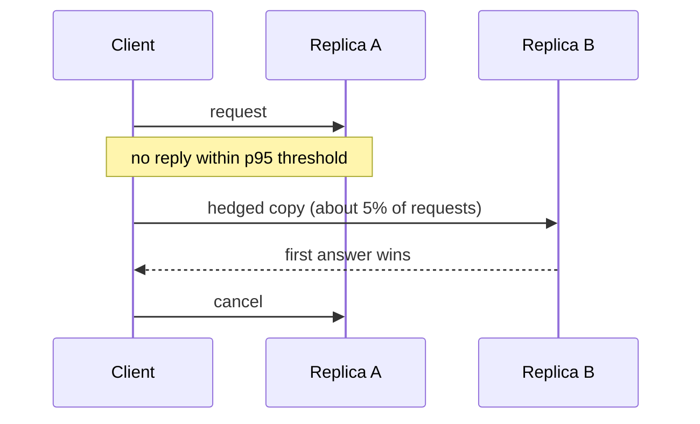

## Purpose

This note is about what to do when "just queue it" stops working. Two pathologies show up repeatedly:

- one subtask becomes a straggler and holds the whole job open
- too much work is admitted and queues become self-destructive

The fixes often look wasteful locally and correct globally.

## Stragglers

In fan-out systems, completion time is often

$$
T = \max(T_1, \dots, T_k)
$$

for shard requests or parallel tasks. One laggard dominates the whole operation.

Causes include:

- noisy neighbors
- cache misses
- unlucky placement
- transient hardware slowdown
- skewed input partitions

Why one laggard dominates is arithmetic: if each of $k$ subtasks independently exceeds a threshold with probability $p$, the job exceeds it with probability $1 - (1-p)^k$ — at $k = 100$ and $p = 0.01$, that is 63%. The per-server p99 becomes the fan-out median. The full percentile treatment is in [[systems/performance/tail-latency-percentiles|Tail Latency and Percentiles]]; this note is about the scheduling responses.

## Speculative Execution

Batch systems like MapReduce launch a duplicate of the slowest remaining tasks near the end of a job; a task completes when either copy finishes. The [MapReduce paper](https://research.google/pubs/pub62/) reports the canonical evidence: with backup tasks disabled, their terasort benchmark took **44% longer** — an entire job stretched by its last few stragglers — while backup execution cost only a few percent extra compute. The mechanism matches the arithmetic above: near job end, idle capacity is plentiful (most tasks finished), so a duplicate is nearly free, and $\min$ of two draws from a straggler-contaminated distribution collapses the tail. A quick simulation of the effect (repo venv): 10,000 tasks with exponential runtimes, 1% inflated 10x — the last-wave maximum drops from 66.5 to 11.0 time units when stragglers get one backup copy.

Speculation is attractive when:

- late tasks are few (speculate on the last stragglers, not the whole job)
- idle capacity exists (end-of-job is exactly when it does)
- stragglers are slow for *machine* reasons (noisy neighbor, bad disk) rather than *input* reasons — a duplicate of a skewed partition is equally slow; skew needs repartitioning, not speculation

It is dangerous when:

- the cluster is already overloaded — duplicates are pure amplification
- the slowdown's cause is shared (a hot HDFS block, a saturated rack switch): the copy competes for the same bottleneck and doubles its load

## Hedged Requests

Online services use the same idea at request latency. Send the request to one replica; if no response within a delay threshold — typically the ~95th-percentile latency — send a copy to a second replica and take the first answer. Thresholding is what makes it cheap: by construction only ~5% of requests hedge, and those are exactly the ones already in the tail. [The Tail at Scale's](https://research.google/pubs/the-tail-at-scale/) benchmark: reading 1,000 keys across 100 BigTable servers, hedging after a 10 ms wait cut p99.9 from **1,800 ms to 74 ms** for ~2% extra requests.



The distributional shape reproduces in a few lines (repo venv, lognormal population, hedge fires above the p95 at 5.19, second draw independent):

| | p95 | p99 | p99.9 | extra load |
| --- | --- | --- | --- | --- |
| no hedge | 5.19 | 10.29 | 22.05 | — |
| hedge after p95 | 5.19 | 6.68 | 9.37 | 5.0% |

And because fan-out takes the max over servers, trimming each server's tail compounds: at fan-out 100, the p50 falls from 11.7 to 7.0 and the p99 from 41.4 to 12.9. Tail-cutting at the leaves is median-cutting at the root.

**Tied requests** push the idea earlier: enqueue the request on *two* servers immediately, each knowing the other's identity; whichever dequeues it first sends a cancel to its twin. This attacks queueing delay (the dominant variable component) without waiting out a hedge threshold, at the cost of cancellation traffic and a corner case when both dequeue simultaneously (mitigated by a small jitter). The Tail at Scale reports tied requests in a BigTable/GFS benchmark cut median latency 16% and p99.9 by ~40%, and — the striking result — an *idle* cluster with tied requests matched within a few percent the latency of a cluster doing no competing work at all.

The danger is the same as speculation's: indiscriminate duplication creates extra load exactly when the system is already struggling, and a hedge storm during a slowdown is a self-inflicted retry storm (the metastable pattern in [[systems/scheduling/4-cluster-and-datacenter/admission-control-backpressure-overload|admission control and overload]]). Good designs:

- hedge only after a delay threshold tied to a live percentile estimate
- cap total hedge rate (a hedge *budget*, like a retry budget)
- cancel losers quickly, so duplicates release capacity the moment the race resolves
- prefer probation (stop sending to an observed-slow replica) when slowness is persistent rather than transient — duplication treats variance, not sustained degradation

## Batch vs. Online

The two settings share the max-of-$k$ arithmetic but differ in every operational constant, which is why the techniques look different:

| | Batch (MapReduce-style) | Online (fan-out service) |
| --- | --- | --- |
| Objective | job makespan | per-request percentile SLO |
| Timescale | minutes-hours; stragglers visible for seconds | milliseconds; no time to observe before acting |
| Detection | compare task progress rates | delay threshold or none (tied requests) |
| Response | re-execute task elsewhere | duplicate the request, first-wins |
| Duplicate cost | one task slot, at end-of-job (nearly free) | full request cost on the serving path |
| Cancellation | kill the losing task | protocol-level cancel, must be fast |

Batch systems can afford to *watch* for stragglers because tasks are long; online systems must *pre-commit* duplication policy because requests are shorter than any detection loop. That is also why batch speculation triggers on relative progress while hedging triggers on absolute delay percentiles.

## Overload

When arrival pressure stays too high, the right move is often to reject or defer work before it enters the deep queue.

A system with infinite patience and finite capacity is not robust. It is a queue-growth machine.

Practical overload tools:

- queue length caps
- token buckets
- deadlines or TTLs
- priority classes
- early rejection or degraded service

## A Tiny Admission Gate

```python
MAX_Q = 256

def admit_or_reject(queue, request):
    if len(queue) >= MAX_Q:
        return "reject"
    queue.append(request)
    return "admit"
```

Crude, but often healthier than accepting every request into a queue that guarantees failure later.

## Mental Model

- speculation fights variance after work has started
- admission control fights instability before work starts

Both are scheduling policies about tail behavior, not just implementation details.

## Related Notes

- [[systems/distributed-systems/load-balancing|Load Balancing]]
- [[systems/scheduling/0-foundations/queueing-models-and-tail-latency|Queueing Models and Tail Latency]]
- [[systems/scheduling/4-cluster-and-datacenter/cluster-scheduling-and-dominant-resource-fairness|Cluster Scheduling and DRF]]
- [[systems/scheduling/4-cluster-and-datacenter/admission-control-backpressure-overload|Admission Control, Backpressure, and Overload Management]]
- [[systems/performance/tail-latency-percentiles|Tail Latency, Percentiles, and Queueing Distributions]]
- [[ml/serving-systems/speculative-decoding|Speculative Decoding]]

