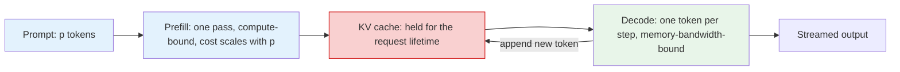

## Purpose

The scheduling problem in LLM serving is not "pick the next request" in the old CPU sense. The scheduler makes three nested decisions on different clocks:

1. **Admission** (per request): does this request enter the running set at all, given KV-cache and SLO headroom? This is the [[systems/scheduling/4-cluster-and-datacenter/admission-control-backpressure-overload|admission-control]] problem with VRAM as the bounded buffer.
2. **Batch composition** (per iteration, ~tens of ms): which admitted requests run in this forward pass, and how much prefill rides along with the decodes?
3. **Token-step selection** (inside the iteration): when compute or memory is scarce, whose token is produced — the priority/fairness decision.

Keeping the three distinct matters because they fail differently: bad admission overflows the KV cache and forces preemptions, bad batch composition blows the per-token SLO, and bad token-step policy starves someone. The queueing and fairness ideas are familiar; the cost model is not.

## Two Phases, Two Different Costs

Autoregressive serving has two major phases:

- **prefill**: process the input prompt
- **decode**: generate one token at a time

Prefill wants large matrix multiplies and is compute hungry. Decode is dominated much more by KV-cache reads and memory traffic.



The simple cost model that drives everything (constants derived in [[ml/serving-systems/performance-modeling|Performance Modeling]]): a prefill over $p$ prompt tokens costs one pass of compute proportional to $p$ — a 2,000-token prompt is roughly 2,000 tokens' worth of FLOPs in one iteration — while a decode step costs one token of compute per request but must stream the *entire model plus that request's KV cache* through memory. Decode alone is therefore memory-bandwidth-bound at any realistic batch size, and batching decodes is nearly free in time until the batch approaches the compute roofline. The scheduling consequences:

- A batch of decodes runs at essentially the speed of one decode; filling the batch is pure throughput.
- One large prefill inserted into a decode batch stretches that iteration for *everyone* — the prompt's tokens all cost compute now, so every co-scheduled request's inter-token latency takes the hit.
- KV-cache memory, not compute, is usually what limits the running set: each active request holds cache proportional to its live token count for its entire lifetime.

So one scheduler is implicitly solving two different resource-allocation problems, coupled through a shared memory budget.

## Why Batching Is Scheduling

Batching is not just throughput optimization. It is the serving scheduler's main control knob.

- Large batches improve hardware utilization.
- Large batches increase waiting time.
- Prefill-heavy batches can stall decode-heavy workloads.

That is a scheduling tradeoff, not a library setting.

## Continuous Batching

The key [Orca](https://www.usenix.org/system/files/osdi22-yu.pdf) idea is **iteration-level scheduling**: the scheduler invokes the engine for a single forward pass at a time, so new work enters at token-step boundaries instead of waiting for an entire request batch to drain, and finished requests exit immediately rather than padding out the batch. The companion mechanism, **selective batching**, is what makes mixed batches executable: element-wise and linear ops batch across requests regardless of their differing lengths, while attention runs per-request. Together these produced Orca's headline 36.9x throughput gain over request-level batching at equivalent latency.

That reduces idle slots, but it also creates interference:

- long prefills can delay many decodes
- long decodes consume KV-cache capacity for a long time

## Admission and Preemption in a Real System

[vLLM](https://arxiv.org/abs/2309.06180) is the reference implementation of the admission layer. PagedAttention allocates KV cache in fixed-size blocks on demand (the memory story is in [[ml/serving-systems/memory-management|Memory Management]]), which converts admission into a block-budget problem: admit from the FCFS queue while free blocks remain above a watermark, held back so that running requests — whose future lengths are unknown — have room to grow a few steps without immediate crisis.

When growth outruns the reserve anyway, the scheduler must **preempt**: evict a running request's KV blocks and either **swap** them to host memory (cheap to write, but re-admission is gated on PCIe bandwidth) or **discard and recompute** the cache later (wastes FLOPs, but recomputation of a whole prompt is one efficient prefill, often faster than paging back in). vLLM preempts newest-first, protecting the requests with the most sunk cost. The design point worth internalizing: because output lengths are unpredictable, *some* preemption mechanism is mandatory — the only choice is which currency (bandwidth or FLOPs) pays for it, the same recompute-versus-store trade as gradient checkpointing.

## Chunked Prefill and Disaggregation

Chunked prefill ([Sarathi](https://arxiv.org/abs/2308.16369)) breaks the prompt into bounded pieces so decode latency is less hostage to giant prompts: each iteration carries a capped token budget of prefill chunk alongside the decode batch, piggybacking prompt work into the memory-bound decode iterations' spare compute. Prefill/decode disaggregation ([DistServe](https://arxiv.org/abs/2401.09670)) goes further and places the two phases on different machines or pools, so TTFT and inter-token latency stop competing for the same iteration budget at all — at the cost of shipping KV caches between pools.

This is another way of saying:

- classify work by service shape
- stop forcing incompatible work classes through one queue

That is classic scheduling wisdom wearing new clothes — the mice-and-elephants separation of [[systems/scheduling/3-network-and-packet/fair-queueing-wfq-and-drr|fair queueing]] with prompts for elephants.

## What a Practical Scheduler Optimizes

Common objectives:

- maximize throughput
- keep TTFT below a target
- keep per-token latency below a target
- avoid starvation of long prompts
- share service fairly across users

Those objectives conflict. A scheduler that greedily favors short prompts may look excellent on average and still be unusable for users with long contexts.

**Fairness has an LLM-specific twist**: requests differ by orders of magnitude in cost (a 10-token question vs a 100k-token document), so per-request fairness is meaningless. The [Virtual Token Counter](https://arxiv.org/abs/2401.00588) (OSDI 2024) is WFQ transplanted: track a per-client virtual counter that advances with *weighted service received* (their cost function counts input and output tokens with different weights, e.g. output tokens ~2x input, reflecting compute cost), and at each iteration admit work from the client with the lowest counter. Backlogged clients' service difference stays bounded by a constant — the WFQ/DRR fairness guarantee, with tokens as the byte-equivalent — and a client flooding requests only inflates its own counter, so isolation holds without per-request rate caps. Counters freeze while a client is idle (no banked credit), the same no-credit-for-idleness rule as DRR's deficit reset.

## Skeleton Scheduler Loop

One iteration of a vLLM-shaped scheduler, showing all three decision layers in their actual order — running requests first (they hold committed cache), then preemption if the cache overflowed, then admission with chunked prefill under a per-iteration token budget:

```python
def schedule_iteration(running, waiting, free_blocks, watermark,
                       token_budget, fair_counters):
    batch = []

    for req in running:                       # 1. decodes: one token each,
        need = blocks_for_next_token(req)     #    may need one new block
        if need > free_blocks:
            victim = newest(running)          # preempt: newest-first,
            free_blocks += release(victim)    # recompute-later policy
            waiting.appendleft(victim)
            if victim is req:
                continue
        free_blocks -= need
        batch.append((req, 1))                # (request, tokens this pass)

    budget = token_budget - len(batch)        # 2. spare compute this pass
    while waiting and budget > 0:
        req = min(waiting, key=lambda r: fair_counters[r.client])  # 3. VTC pick
        chunk = min(req.remaining_prefill, budget)
        need = blocks_for(chunk)
        if need > free_blocks - watermark:    # admission: keep the reserve
            break
        free_blocks -= need
        waiting.remove(req)
        batch.append((req, chunk))
        budget -= chunk
        fair_counters[req.client] += cost(chunk_in=chunk)

    return batch                              # one fused forward pass
```

Real systems need much more machinery (swapping, priority classes, SLO deadlines, length prediction), but every production scheduler is recognizably this loop: capacity check against the block budget, latency check against the iteration token budget, fairness check via the counter, then admit.

## Scheduling Heuristics That Matter

- Separate short and long prompts when possible.
- Do not let giant prefills repeatedly blow up decode latency.
- Treat KV-cache capacity like a first-class scheduling resource.
- Track user fairness, not only request fairness.
- Reject or defer work early if admitting it guarantees SLO failure.

## Related Notes

- [[ml/serving-systems/batching|Batching]]
- [[ml/serving-systems/performance-modeling|Performance Modeling]]
- [[ml/serving-systems/memory-management|Memory Management]]
- [[systems/scheduling/4-cluster-and-datacenter/admission-control-backpressure-overload|Admission Control, Backpressure, and Overload Management]]
- [[systems/scheduling/3-network-and-packet/fair-queueing-wfq-and-drr|Fair Queueing, WFQ, and DRR]]
- [[systems/scheduling/4-cluster-and-datacenter/stragglers-speculation-and-overload|Stragglers, Speculation, and Overload]]

