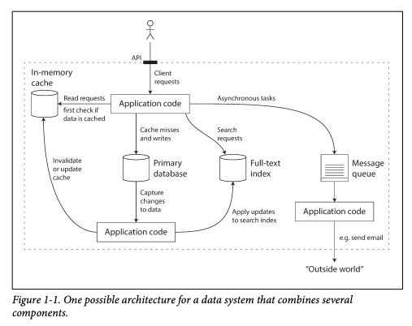

# Chapter 1
## Reliable, Scalable, and Maintainable Applications

### "Data intensive" vs. "Computer intensive"

A data-intensive application is typically built from standard building blocks:

- Store data so that they, or another application, can find it again later (databases)
- Remember the result of an expensive operation, to speed up reads (caches)
- Allow users to search data by keyword or filter it in various ways (search indexes)
- Send a message to another process, to be handled asynchronously (stream proessing)
- Periodically crunch a large amount of accumulated data (batch processing)

