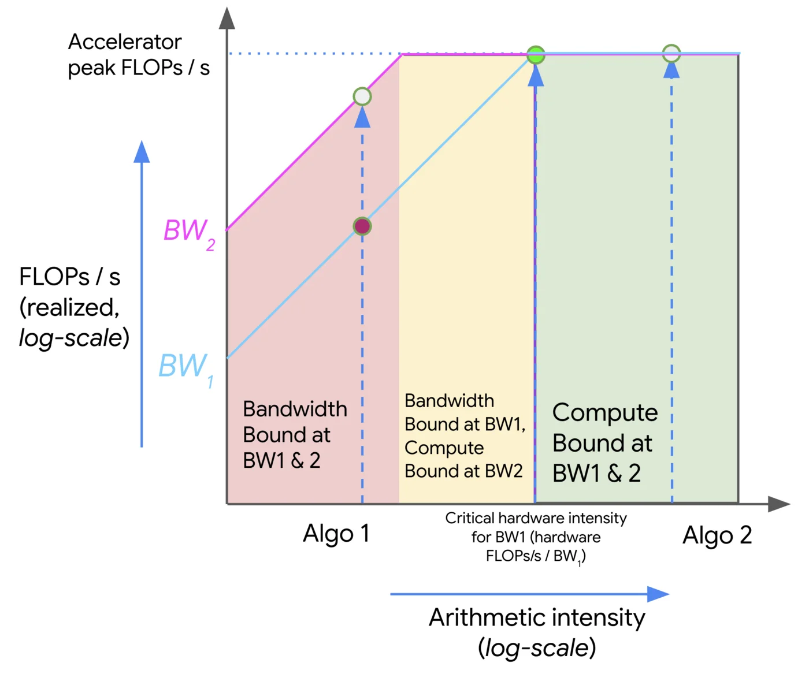

# Scaling with the Roofline Model

> *"When we run algorithms on hardware, we're bounded by three things: how fast it can do math (OPs/second), the bandwidth available for moving data around (bytes/second), and the total memory available to store data (bytes). These “roofline” constraints let us upper and lower bound the time of a given computation." - [How to Scale Your Model - All About Rooflines](https://jax-ml.github.io/scaling-book/roofline/)*

---

## Arithmetic Intensity

> Definition: the arithmetic intensity of an algorithm is given by the ratio of the total FLOPs it performs to the number of bytes it needs to communicate — either within a chip or between chips.

$$
\text{Arithmetic Intensity} = \frac{\text{Computation FLOPs}}{\text{Communication Bytes}}
$$

At a high level, we want to push our models to be as compute-bound as possible, meaning that the arithmetic intensity's demand matches the hardware's supply. This drives utilization up, as opposed to when our model is memory-bound, meaning we have unmatched supply and therefore underutilized hardware.

### Example: Dot-Product

$$
\text{Dot Product} = \sum_{i=1}^{n} a_i b_i
$$

For two vectors $a, b \in \mathbb{R}^n$, we need to load $2n$ elements, write one element, and perform $n$ multiplications and $n-1$ additions (FLOPs). Assuming our datatype is 2 bytes (e.g., float16), we have:

$$
\text{Intensity (dot product)} = \frac{\text{FLOPs}}{\text{Bytes}} = \frac{2n + 1}{2n + 2n + 2} = \frac{2n + 1}{4n + 2}
$$

Then, as $n \to \infty$, we have $\text{Intensity} \to \frac{1}{2}$.

This is *bad*. Modern accelerators can achieve much higher intensity, e.g. NVIDIA H100 ~315 FLOPS/B. The dot-product is thus a memory-bound operation, meaning GPUs will spend most of their time waiting for data to be loaded from memory.

## Roofline Model

Roofline plots visualize arithmetic intensity (x-axis) vs. performance (y-axis), typically both in log scale. The plot is divided into three regions:

- **Roofline**: The upper bound of performance for a given arithmetic intensity. This is the maximum performance that can be achieved given the hardware's compute and memory bandwidth.
- **Compute-bound**: The region where the performance is limited by the compute capability of the hardware. This is where we want to be for compute-heavy workloads.
- **Memory-bound**: The region where the performance is limited by the memory bandwidth. This is where we want to avoid being for compute-heavy workloads.

To travel in the positive $y$ direction, we can either use optimizations like multithreading, vectorization/SIMD, etc., all of which increase the FLOPs achievable of our accelerator, or we can increase the memory bandwidth by using faster memory (e.g., HBM), better access patterns (e.g., coalesced memory access, tiling).

Major challenges are associated with memory boundedness, especially with non-uniform memory access (NUMA) architectures, where memory can be considered either "local" or "remote" to a given core. Without considering allocation and access patterns, you end up with a lot of communication overhead.

For compute bound workloads, we have

$$
\text{OI}(\text{algorithm}) > \text{OI}(\text{accelerator})
$$

and for memory bound workloads, we have

$$
\text{OI}(\text{algorithm}) < \text{OI}(\text{accelerator})
$$

The challenge then becomes reaching the *critical operational intensity*:

$$
\text{OI}(\text{algorithm}) = \text{OI}(\text{accelerator})
$$

Earlier we calculated the operational intensity of the dot product as $\frac{1}{2}$. Given an H100 with 333 FLOPS/B, we're indeed very memory bound.

## Matrix Multiplication with FP16

Given two matrices $A \in \mathbb{R}^{M \times N}$ and $B \in \mathbb{R}^{N \times K}$, consider the OI of the matrix multiplication $C = AB$.

We read $2MN + 2NK$ bytes of data, and write $2MK$ bytes of data to $C$. We do $2MNK$ FLOPs of computation. Thus, we have:

$$
\text{OI}(\text{matmul}) = \frac{2MNK}{2MN + 2NK + 2MK} \approx M \text{ if } M \text { is large}
$$

So as long as $M > 333$, it would be compute bound on the H100.

## Key Hardware Specs for Serving Throughput

- $N_{\text{gpus}}$: Number of GPUs
- $\text{MemBW}$: Memory bandwidth (GB/s)
- $\text{NetBW}$: GPU interconnect bandwidth (GB/s)
- $\text{GPU}_{\text{mem}}$: GPU memory (GB)
- $\text{compute}$: GPU compute (TFLOPS)

## Key Model Specs for Serving Throughput

- $D_\text{model}$: hidden dimension size (`hidden_dim`)
- $L$: number of layers (`num_layers`)
- $P_\text{model}$: number of parameters
- $R_\text{GQA}$: group size of GQA (`group_size`)
- $S_\text{type}$: datatype size (e.g., `float16` = 2 bytes, `bfloat16` = 2 bytes, `int8` = 1 byte)
- $p$: average number of tokens to prefill
- $d$: average number of tokens to decode
- $p + d$: average number of tokens per user request
- $\frac{\text{Throughput}_\text{total}}{p + d}$: per-request throughput
- $d\frac{\text{Throughput}_\text{total}}{p + d}$: decoding throughput

## Execution Time Model

We operate under the assumption we have optimal request batching/workload demand, meaning that we can effectively utilize the available hardware resources.

From a memory standpoint, on each iteration we need to essentially load the entire content of GPU memory (weights, activations, kv cache). We thus have $t_\text{mem} = \frac{\text{GPU}_{\text{mem}}}{\text{MemBW}}$.

From a compute standpoint, activations being multiplied by weights in batches gives us $B_{\text{dense}} K N$ FLOPs, so for all dense operations we have $t_{\text{compute}} = \frac{2 B_{\text{dense}} P_\text{model}}{\text{compute}}$.

Lastly, from a network standpoint, there are two main operations we care about (assuming a model sharded across multiple GPUs): `AllGather` and `AllReduce`.

- `AllGather`: gather the output of each GPU's computation. This takes roughly $N_{\text{gpus} - 1}$ network hops, and typically each layer contains multiple `AllGather` operations (e.g. 4 in llama2).
- `AllReduce`: reduce the gathered outputs across all GPUs. As a rough estimate, this is roughly double the overhead of `AllGather`

$$
\begin{align*}
N_{\text{gpus}} - 1 & \text{ hops} \\
4 & \text{ allgather per layer} \\
B_\text{dense} D_\text{model} & \text{ shape of the activations} \\
S_\text{type} & \text{ size of the datatype}\\
\end{align*}
$$

$$
T_\text{network} = \frac{4(N_{\text{gpus}} - 1) B_\text{dense} D_\text{model} S_\text{type}L}{\text{NetBW}}
$$