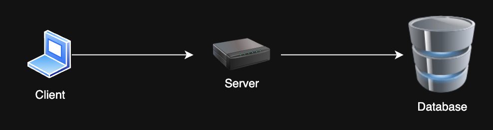
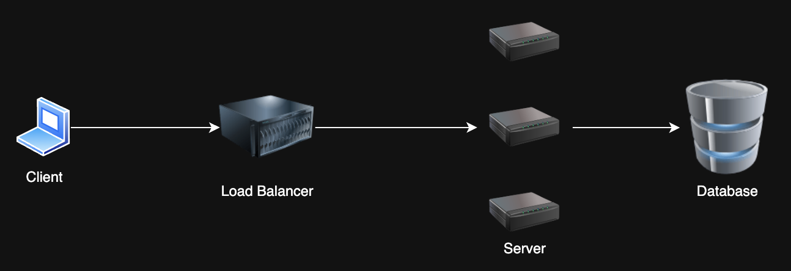
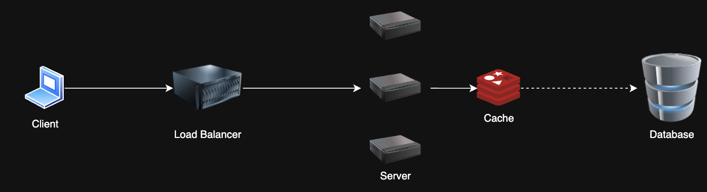
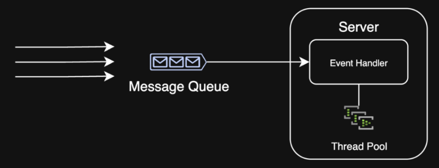
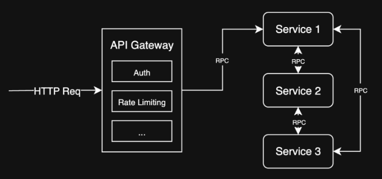
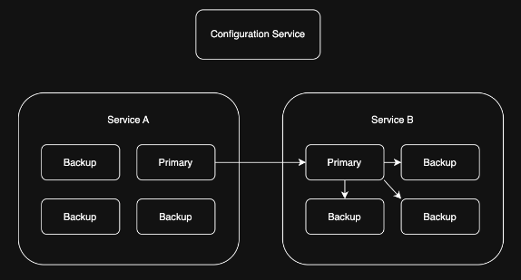
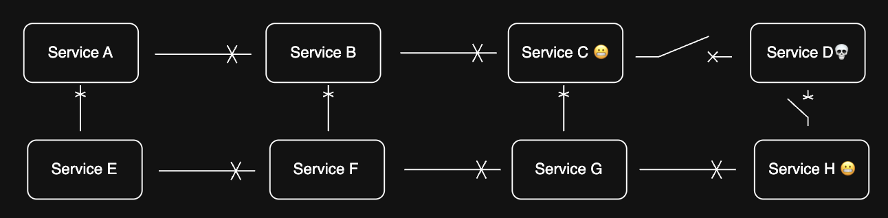

<!-- 
Presentation covering the basics techniques and architectures for solving common scalability/reliability problems in systems.
 -->

<!-- backgroundColor: #121212 -->
<!-- color: #fff -->
<!-- style: normal -->

# Patterns for Scalability and Reliability in Systems

---

## Agenda

1. Client Server Architecture
2. Scalability Patterns
3. Limitations
4. Extending Client Server Architecture
5. Availability/Reliability Patterns
6. Conclusion

---

## Client Server Architecture

- Client-server architecture
- RESTful API
- Stateful vs. stateless services

<!-- alt: Diagram showing client-server architecture -->

---

## Scalability Patterns

### 1. Load Balancing

Problem: I have too many requests! My single server can't take it anymore 😭

Solution: Horizontal scaling with a load balancer -- distribute requests across multiple servers

---

## Scalability Patterns

### 2. Caching

Problem: My database is slow and can't handle all these reads 😩

Solution: Cache frequently/recently accessed data to reduce database load

<!-- alt: Diagram showing caching mechanism -->

---

## Scalability Patterns

### 3. Database Sharding/Partitioning

Problem: My database is massive and can't handle all these writes 😭

Solution: Split the database into smaller, more manageable pieces. Designate a *partition key* to determine which shard to write to.

<!-- alt: Diagram showing database sharding -->

---

## Scalability Patterns

### 3. Queueing

Problem: My system is overwhelmed by bursty traffic and can't process requests fast enough 😩

Solution: Use a message queue to manage requests and process them asynchronously

<!-- alt: Diagram showing database sharding -->

---

## Limitations

### SQL Databases

Problem: SQL databases have limitations on scalability due to ACID properties 😞

- 1,000 writes/sec - Use more than one instance (sharding)
- 10,000 reads/sec - Use read replicas
- 1 TB (1000 GB) - Use partitioning
- 100 million records - Standard B-tree indexing not as effective

Solution: Add replicas, shard, or use a different database

---

## Limitations

#### NoSQL Databases

- Many NoSQL databases scale horizontally and efficiently by default 🥳
- Tradeoff ACID and indexing capabilities for effectively unlimited scalability with the right schema design
- E.g. Cassandra, MongoDB, DynamoDB

---

## Limitations

### Networks

Problem: At scale, network latency and throughput can become a bottleneck 😱

- 50 ms - Good latency over the internet
- 10 ms - Good latency within a data center
- 1 Gbps - Start thinking about multiple servers (or just network interfaces)

Solution: Add more servers and route network traffic, use CDNs/edge caching

---

## Limitations

### Single Hosts

Problem: Single hosts have limitations on CPU, memory, and disk I/O 😡

- 100 GB working set of data in memory - Consider sharding or partitioning
- 1 GB data to cache - Consider using a distributed cache
- 10,000 requests/sec - Consider adding more servers

Solution: Partition for write-heavy workloads, cache data upstream for read-heavy workloads to decrease requests

---

### Service-Oriented Architecture (SOA)

Problem: My monolithic architecture is hard to maintain and scale 😖

Solution: Break down the monolith into smaller, more manageable services. Each service is responsible for a specific task and can be scaled independently.

<!-- alt: Diagram showing service-oriented architecture -->

---

## Extending Client Server Architecture

### API Gateway

Problem: I have multiple services which are non-uniform, and clients need to access them all 😩

Solution: Use an API Gateway to route requests to the appropriate service

---

## Availability/Reliability Background

- Availability: System is operational and accessible
- Reliability: System performs as expected under normal conditions

Why do we need a reliable system?

- 99.999% uptime = 5.26 minutes of downtime per year
- With 100 services, each with 99.999% uptime, the system *could* be down for 8.76 hours per year (assuming everything is a single point of failure)

To put it into perspective, AWS EC2's *Service Level Agreement* is 99.99% uptime, which allows for 52.56 minutes of downtime per year

So building on top of cloud services still requires going the extra mile to ensure reliability

---

## Reliability Patterns

### 1. Replication

Problem: I have a stateful, purpose-built service that needs to be highly available 😅

Solution: Primary forwards writes to replicas, which can take over if the primary fails

<!-- alt: Diagram showing data replication across servers -->

---

## Reliability Patterns

### 2. Circuit Breaker

- Prevents system failures from cascading
- Monitors and isolates failing components

<!-- alt: Diagram showing circuit breaker pattern -->

---

## Reliability Patterns

### 3. Graceful Degradation

Design systems to maintain (at least) partial functionality during failures
- If a service is down, show cached data
- If a service is overloaded, timeout gracefully and retry later

Limit hard dependencies and keep services decoupled

---

# Questions?